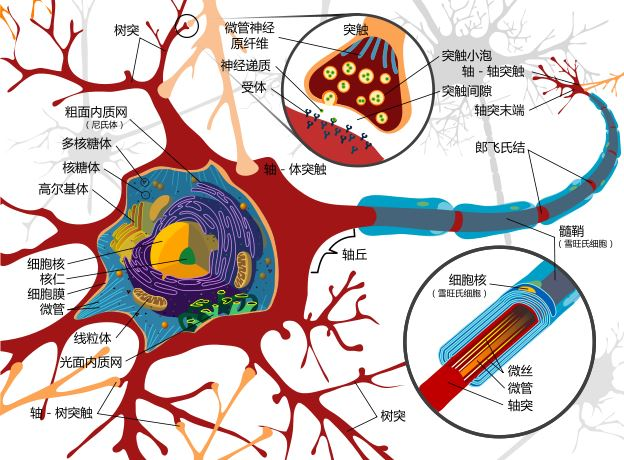
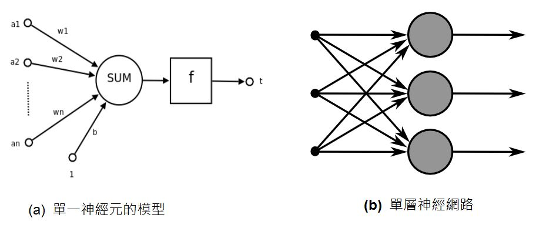

## 神經網路簡介

在電腦領域，神經網路是指一種模擬神經系統所設計出來的程式，用來模擬人類視覺、聽覺等等智慧行為的原理，企圖讓電腦可以具有人類智慧的一種方法。

下圖是生物神經細胞的結構圖，這個圖看來頗為複雜，如果電腦程式真的要模擬這麼複雜的結構，那程式應該也會非常複雜才對。



還好、神經網路程式不需要去模擬「細胞膜、粒線體、核醣體」等等複雜的結構，因為學電腦的人可以透過「抽象化」這個伎倆，將上述的神經細胞結構簡化成下圖 (a) 的樣子。

在下圖中，a1 ... an 是輸入，w1 ... wn 是權重，這些輸入乘上權重之後加總(SUM)，就會得到神經元的刺激強度，接著經過函數 f() 轉換之後，就得到了輸出的刺激強度。



上圖 (a)所對應的數學公式如下：

```math
t=f(\vec{w} \cdot \vec{a}+b)=f(\sum_{i=1}^n (w_i * a_i) + b)
```

其中的 b 值是用來作為門檻的閥值，舉例而言，若 b 是 -0.5，那麼就代表要將總合減掉 0.5，才得到輸入刺激強度，這可以用來調節刺激強度，才不會一直增強上去。

而上圖 (b) 中的網路，是一種單層的神經網路，所謂單層是不計算輸入節點的計算方式，因此只有圖中的大圈圈才算是一層，其中每個大圈圈都是如圖 (a) 中的一個神經元。

最早的神經網路程式稱為感知器（Perceptron），這是由 Frank Rosenblatt 在 1957 年於 Cornell 航空實驗室 (Cornell Aeronautical Laboratory) 所發明的。

但是在 1969 年，Marvin Minsky 和 Seymour Papert 在《Perceptrons》書中，仔細分析了知器為的功能及局限，證明感知器不能解決簡單的 XOR 等問題，結果導致神經網路技術經歷了長達 20 年的低潮期。

後來在 1986 年，Rumelhart 等人於下列論文中提出「反向傳播」(back-propagation) 演算法，並成功的被運用在語音辨識等領域之後，神經網路才又開始成為熱門的研究主題。

> Rumelhart, David E.; Hinton, Geoffrey E., Williams, Ronald J. Learning representations by back-propagating errors. Nature. 8 October 1986, 323 (6088): 533–536.

事實上、反向傳播的方法，並不是 Rumelhart 等人第一個提出來的，Paul J. Werbos 1974 年在哈佛的博士論文中就提出了類似的方法，只是大家都不知道而已。

> Paul J. Werbos. Beyond Regression: New Tools for Prediction and Analysis in the Behavioral Sciences. PhD thesis, Harvard University, 1974

當然、神經網路再度成為研究焦點之後，各式各樣的方法又被發展出來了，大致上這些方法可以分為兩類，一種稱為「有指導者」的神經網路(Supervised Neural Network) ，像是「感知器與反傳遞演算法」等，另一種稱為「沒有指導者」的神經網路 (Unsupervised Neural Network)，像是「霍普菲爾德網路 (Hopfield Network) 與自組織神經網路 (Self Organization network)」等等。

當然、神經網路並不是「神奇銀彈」，可以解決人工智慧上的所有問題，神經網路最強大的地方是容錯性很強，而且不需要像專家系統這樣撰寫一堆規則，但是有一得必有一失，神經網路自動學習完成之後，我們根本不知道該如何再去改進這個學習成果，因為那些權重對人類來說根本就沒有什麼直觀的意義，因此也就很難再去改進這個網路了。

不過、程式能夠自我學習畢竟是一件很神奇的事情，光是這點就值得讓我們好好的去瞭解一下神經網路到底是怎麼運作的了！

### 參考文獻
* [Wikipedia:Neuron](http://en.wikipedia.org/wiki/Neuron)
* [Wikipedia:Artificial neuron](http://en.wikipedia.org/wiki/Artificial_neuron)
* [Wikipedia:Artificial neural network](http://en.wikipedia.org/wiki/Artificial_neural_network)
* [Wikipedia:Perceptron](http://en.wikipedia.org/wiki/Perceptron)
* [Wikipedia:Backpropagation](http://en.wikipedia.org/wiki/Backpropagation)
* [維基百科：感知器](http://zh.wikipedia.org/wiki/%E6%84%9F%E7%9F%A5%E5%99%A8)
* [維基百科：人工神經網路](http://zh.wikipedia.org/wiki/%E4%BA%BA%E5%B7%A5%E7%A5%9E%E7%BB%8F%E7%BD%91%E7%BB%9C)
* [維基百科：赫布理論](http://zh.wikipedia.org/wiki/%E8%B5%AB%E5%B8%83%E7%90%86%E8%AE%BA)


【本文由陳鍾誠取材並修改自 [維基百科]，採用創作共用的 [姓名標示、相同方式分享] 授權】