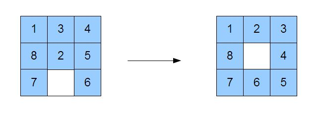

# 實作：以廣度優先搜尋解決拼圖問題

### 前言

以下的「拼圖問題」是將一個已經移動打亂過的拼盤，想辦法移動回原本樣子的問題。



在以下程式中，我們用一個 3*3 的陣列來代表拼盤，並且用數字 0 來代表其中的空格，因此將方塊 2 移動到空格，其實是用將 0 與 2 兩個數字位置交換所達成的。

透過這樣的資料結構，我們就可以用「廣度優先搜尋」(BFS) 來解決拼圖問題了，以下是我們用 JavaScript 實作，並用 node.js 進行測試的結果。

### 程式實作：拼圖問題

檔案：puzzleSearch.py

```python
from copy import deepcopy

def enqueue(a, o):
    a.insert(0,o)

def dequeue(a):
    return a.pop()

def findXY(board, value):
    for x in range(len(board)):
        for y in range(len(board[x])):
            if board[x][y] == value:
                return x,y
    return None

def boardClone(b):
    return deepcopy(b)

def board2str(b):
    rows = []
    for row in b:
        rows.append(str(row))
    return '\n'.join(rows)

def swap(b,x1,y1,x2,y2):
    x2 = round(x2)
    y2 = round(y2)
    if x2<0 or x2 > 2 or y2<0 or y2>2:
        return False
    t = b[x1][y1]
    b[x1][y1]=b[x2][y2]
    b[x2][y2]=t
    return True

def move(board, dir): # 加入所有可能的移動方式
    x,y = findXY(board, 0) # 找出空格 0 的位置
    nboard = boardClone(board)
    s = False
    if dir == 'up':
        s=swap(nboard,x,y,x-1,y) # 空格和上面一格交換
    elif dir == 'right':
        s=swap(nboard,x,y,x,y+1) # 空格和右邊一格交換
    elif dir == 'down':
        s=swap(nboard,x,y,x+1,y) # 空格和下面一格交換
    elif dir == 'left':
        s=swap(nboard,x,y,x,y-1) # 空格和左邊一格交換

    return nboard if s else None

def moveAdd(board, dir, neighbors): # 向 dir 方向移動，並加入到 neighbors 陣列中
    nboard = move(board, dir)
    if nboard != None:
        neighbors.append(nboard)

def getNeighbors(board): # 取得所有鄰居
    neighbors = []
    moveAdd(board, 'up',    neighbors)
    moveAdd(board, 'down',  neighbors)
    moveAdd(board, 'right', neighbors)
    moveAdd(board, 'left',  neighbors)
    return neighbors

def bfs(q, goal): # 廣度優先搜尋
    while len(q) > 0:
        node = dequeue(q) #  否則、取出 queue 的第一個節點。
        nodestr = board2str(node)
        if node == goal: return True
        if visited.get(nodestr) == None: #  如果該節點尚未拜訪過。
            visited[nodestr] = True      #    標示為已拜訪
        else:                            #  否則 (已訪問過)
            continue                     #    不繼續搜尋，直接返回。
        neighbors = getNeighbors(node)   #  取出鄰居。
        for n in neighbors:              #  對於每個鄰居
            nstr = board2str(n)
            if visited.get(nstr) == None:#  假如該鄰居還沒被拜訪過
                parent[nstr] = nodestr
                level[nstr] = level[nodestr] + 1
                enqueue(q, n)            # 就放入 queue 中
    return False

def backtrace(goal):
    print('======= backtrace =========')
    nodestr = board2str(goal)
    while nodestr != None:
        print('{}\n'.format(nodestr))
        nodestr = parent.get(nodestr)

goal = [[1,2,3], 
        [8,0,4],
        [7,6,5]]

start= [[1,3,4], 
        [8,2,5],
        [7,0,6]]

queue=[start] # BFS 用的 queue, 起始點為 1。
visited={}
parent={}
level={}
level[board2str(start)]=0
found = bfs(queue, goal) #  呼叫廣度優先搜尋。
print('bfs:found=', found)
if found:
    backtrace(goal)

```

### 執行結果

```
mac020:04-graphSearch mac020$ python3 puzzleSearch.py
bfs:found= True
======= backtrace =========
[1, 2, 3]
[8, 0, 4]
[7, 6, 5]

[1, 0, 3]
[8, 2, 4]
[7, 6, 5]

[1, 3, 0]
[8, 2, 4]
[7, 6, 5]

[1, 3, 4]
[8, 2, 0]
[7, 6, 5]

[1, 3, 4]
[8, 2, 5]
[7, 6, 0]

[1, 3, 4]
[8, 2, 5]
[7, 0, 6]
```

### 結語

在上述執行結果中，我們是將盤面拼完後，才逆向追蹤印出移動過程，因此整個移動方法應該從最下面的盤面看起。換句話說，真正的順序如下：

```
1,3,4    1,3,4    1,3,4     1,3,0    1,0,3    1,2,3
8,2,5 => 8,2,5 => 8,2,0 =>  8,2,4 => 8,2,4 => 8,0,4
7,0,6    7,6,0    7,6,5     7,6,5    7,6,5    7,6,5
```

從上面過程中，您可以看出我們的程式將打亂的盤面給拼回來了。

【本文由陳鍾誠取材並修改自 [維基百科]，採用創作共用的 [姓名標示、相同方式分享] 授權】

