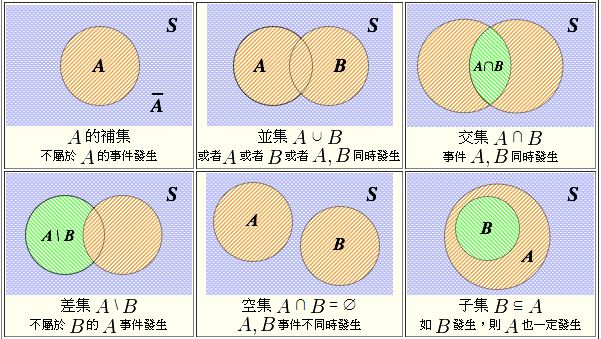
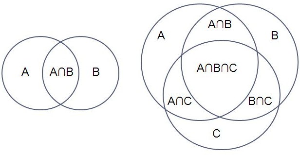
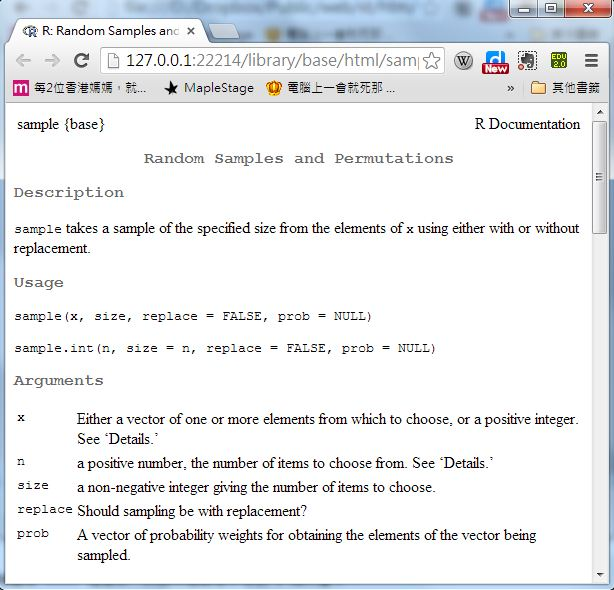
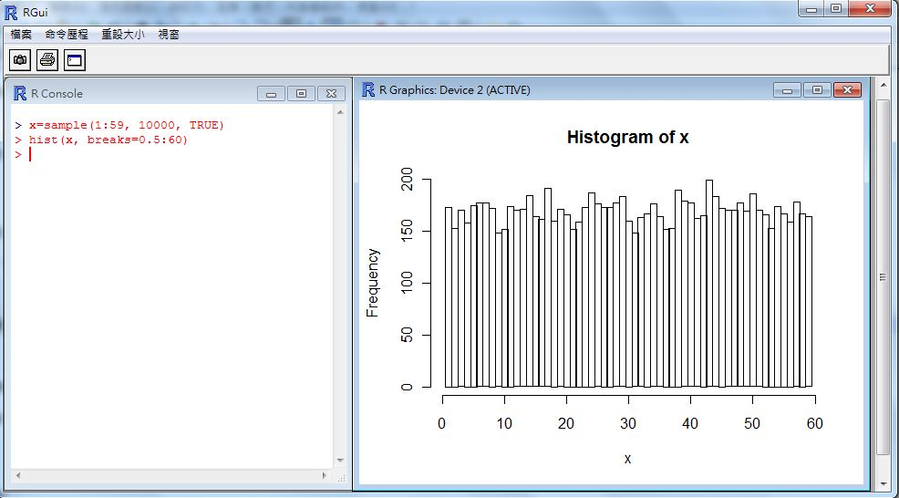
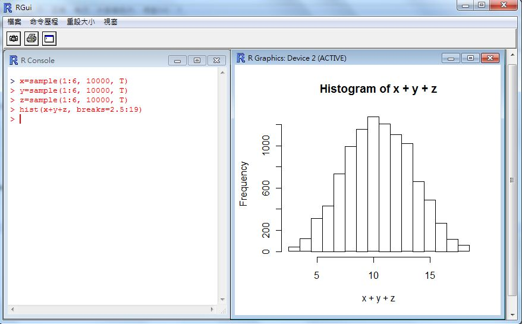

# 機率的概念

## 樣本空間

機率論中，樣本空間是一個實驗或隨機試驗所有可能結果的集合，而隨機試驗中的每個可能結果稱為樣本點。通常用 S、Ω 或 U 表示。例如，如果拋擲一枚硬幣，那麼樣本空間就是集合{正面，反面}。如果投擲一個骰子，那麼樣本空間就是 {1,2,3,4,5,6} 。

## 事件

一個事件是由樣本空間中的一個子集合，例如令 A 為骰子的點數為 {1, 3, 5} 的事件，其機率可以寫為 P(A) = P({1,3,5})。

## 機率的詮釋方法

某個事件的發生率，機率很低代表該事件不太可能出現 (很罕見，但是並非不會出現)，機率很高代表該事件非常可能發生。

機率的詮釋方式可以分為下列三種方式。

詮釋 1. 個人方式：(Personal Approach) : 完全按照個人直覺的解釋方式 (不客觀)。

詮釋 2. 相對頻率方式 (Relative Frequency Approach) ： $$P[A] = \frac{f}{n}$$

* 說明：f 為實驗中事件 A 出現的次數，n 為實驗進行的次數。 此方法乃是基於實驗觀察的結果的方式。

詮釋 3. 古典方式 (Classical Approach) ： $$P[A] = \frac{n(A)}{n(S)}$$

* 說明： n(A) 為事件 A 可能出現的次數 N(S) 為實驗可能進行的次數。此方法乃是將將實驗的可能出像 (outcome) 假設為等可能發生 (equaly likely)。

## 機率公理

一般人學習數學的時候都是從直覺概念開始的，例如我們小學的時候透過算幾個蘋果學到加法，然後用好幾排的蘋果學到乘法，接著就會背誦九九乘法表，然後在中學的時候導入變數的觀念，於是學會了聯立方程式的解法。

但是數學家們看數學往往是從公理系統開始的，透過公理系統進行推論以建立定理，然後推論出整個數學體系。讓我們學習一下數學家的想法，先來看看機率的公理系統有何特色。

以下三條法則是機率的基本公理：(初等機率測度)

> 公理 (1). $$P(S) = 1$$
> 
> 公理 (2). $$P(A) \ge 0$$
> 
> 公理 (3). $$P(A1 \cup A2) = P(A1) + P(A2) \; ; \; if \; A1 \cap A2 = \emptyset$$

公理 (1) 中的 S 代表機率的樣本空間，也就是所有可能發生的事件所形成的集合，這個集合的發生機率為 1，意義是沒有任何事件落在樣本空間之外。

公理 (2) 中的 A 代表任一事件，而 $$P(A) \ge 0$$  則代表任何事件的發生機率必須是正的，沒有負的機率值。

公理 (3) 中的 A1, A2 代表任兩個事件，如果 A1 與 A2 沒有交集，那麼其聯集發生的機率將會是其機率的總和，也就是 $$P(A1 \cup A2) = P(A1) + P(A2)$$ 。

以上機率公理稱為《初等機率測度》公理，但 Kolmogorov 後來又提出了 《Kolmogorov 機率測度》公理系統，將上述的第三條公理改為如下版本：

> 第三公理：任意兩兩不相交事件 $$E_1, E_2, ...$$ 的可數序列滿足 $$P(E_1 \cup E_2 \cup \cdots) = \sum P(E_i)$$ 。即，不相交子集的並的事件集合的機率為那些子集的機率的和。這也被稱為是σ可加性。如果存在子集間的重疊，這一關係不成立。

這兩個公理系統之間，雖然看來差不多，但《Kolmogorov 機率測度》的涵蓋性較好，可以適用在一些《初等機率測度》所無法適用的領域，因此現在的機率教科書上大多是採用《Kolmogorov 機率測度》的公理系統。

有關為何要將《初等機率測度》延伸成《Kolmogorov 機率測度》公理系統，請參考下列文章。

* [《初等機率測度》與《Kolmogorov 機率測度》之間的差異！](st:axioms)
* [《機率論為何要建立在機率空間上面?》 (PDF)](http://w3.math.sinica.edu.tw/math_media/d202/20207.pdf)  -- 蔡聰明


當公理系統確定下來之後，我們就可以透過這些法則進行一些基本的推論，舉例而言，我們應該可以很容易的證明以下這些定理。

> 定理 1. $$P(\emptyset) = 0$$
> 
> 定理 2. $$P(A') = 1-P(A)$$
> 
> 定理 3. $$P(A1 \cup A2) = P(A1) + P(A2) - P(A1 \cap A2)$$

但是，這些定理又代表甚麼意義呢？其實從下列凡氏圖上可以很清楚的看得出來這些定理的直覺意義。



基本上，機率系統是建構在集合論之上的一門數學系統，所以我們可以用集合論的凡氏圖來理解這些公理與定理的意義。下圖左方是兩個集合 A,B 所形成的凡氏圖，而右方則是三個集合 A, B, C 所形成的凡氏圖。



### 習題：機率定理的證明

習題 1 : 

> 定理：證明 $$P(\emptyset) = 0$$ 
> 
> 證明：
> 
> $$P(S\cup\emptyset) = P(S)+P(\emptyset)$$ ; 根據公理 (3)
> 
> $$S = S\cup\emptyset$$ ; 根據集合論
> 
> $$P(S) = 1$$ ; 根據公理 1
> 
> $$1 = P(S) = P(S\cup\emptyset) = P(S)+P(\emptyset)$$ ; 根據集合論與公理 (3)
> 
> 所以 $$P(\emptyset) = 1-P(S) = 1-1 = 0$$

習題 2 : 

> 定理：證明 P(A') = 1-P(A) ; 其中的 A' 代表 A 的補集，也就是 $$A\cup A' = S ; A\cap A' = \emptyset$$
> 
> 證明：
> 
> 因為 $$A\cup A' = S ; A\cap A' = \emptyset$$ ; 根據 A' 的定義
> 
> $$P(A' \cup A) = P(A') + P(A)$$ ; 根據公理 3
> 
> $$P(A') + P(A) = P(A' \cup A) = P(S) = 1$$ ; 根據公理 3 與公理1
> 
> 所以 $$P(A') = 1-P(A)$$
 
習題 3 : 

> 定理：證明 $$P(A1 \cup A2) = P(A1) + P(A2) - P(A1 \cap A2)$$ 
> 
> 證明：
> 
> 因為 $$A1 \cup A2 = (A1-(A1 \cap A2)) \cup A2$$ ; 根據集合論 (用文氏圖可以理解其直覺意義)
> 
> $$(A1-(A1 \cap A2)) \cap A2 =  \emptyset$$  ; 根據集合論 (用文氏圖理解，只是為了方便)
> 
> $$P(A1) = P((A1-(A1 \cap A2))\cup (A1 \cap A2) ) = P(A1-(A1 \cap  A2)) + P (A1\cap A2)$$ ; 根據公理 3
> 
> 所以 $$P(A1-(A1 \cap  A2)) = P(A1) -  P (A1\cap A2)$$
> 
> 推論 $$P(A1 \cup A2) = P((A1-(A1 \cap  A2)) \cup A2) = P(A1-(A1 \cap  A2)) + P(A2)$$ 
> 
> $$=  P(A1) -  P (A1\cap A2) + P(A2) = P(A1) + P(A2) -  P (A1\cap A2)$$  ;
> 
> 所以 $$P(A1 \cup A2)= P(A1) + P(A2) -  P (A1\cap A2)$$

## 機率模型

因此、只要指定了所有可能事件的發生率，我們就可以完整的描述一個機率模型，舉例而言，日常生活中最常見的機率模型，大概就是丟銅板和擲骰子了，
以下是我們對這兩個機率系統的描述。

範例 1：丟銅板

> 在投擲銅板的機率過程中，其樣本空間 S={正, 反} ，
> 
> 而其中一個常見的隨機變數 X ，是用來計算銅板的正面數量，
> 	
> 此時，P(正) = 0.5，而 P(反) = 0.5

範例 2：擲骰子
 
> 在投擲骰子的機率過程中，其樣本空間 S={1點,2點,3點,4點,5點,6點}，
> 
> 此時，P(1點) = P(2點) = ... = P(6點) = 1/6。

所以，在一次擲骰子中，得到 5 點或者 6 點的機率，可以圖示如下。


### 練習：R 軟體與機率密度函數

我們可以透過 R 軟體進一步瞭解機率密度函數的意義，舉例而言， R 當中有個 sample() 函數，我們只要使用該函數就可以模擬擲骰子或銅板的過程。

您可以用 「?函數」 的方式查詢某函數的功能，因此當我們在 R 軟體中鍵入 ?sample 時， R 軟體會輸出下列訊息：

```
> ?sample
starting httpd help server ... done
```

然後就開啟下列的網頁畫面



您可以看到 sample 函數的原型為 `sample(x, size, replace = FALSE, prob = NULL)`，於是可以用下列指令模擬投擲骰子十次的行為。

```
> sample(1:6, 10)
錯誤在sample(1:6, 10) : 
  cannot take a sample larger than the population when 'replace = FALSE'
> sample(1:6, 10, replace=TRUE)
 [1] 3 2 4 4 4 2 6 3 3 3
> 
```

您可以看到當我們用 `sample(1:6, 10, replace=TRUE)` 的指令時，可以正確的模擬出投擲骰子十次的隨機過程，得到 3 2 4 4 4 2 6 3 3 3 這個序列，
但是若我們沒有指定 replace=T (TRUE)，的時候，代表要採用取樣後不放回的方式，但是這種方式最多只能做六次，所以就得到失敗的結果。

不過如果我們指定的樣本數 k 在六個以下，那麼 sample(1:6, k) 是會成功的，以下是一個範例：

```
> sample(1:6, 6)
[1] 2 6 4 1 5 3
```

同樣的，我們也可以用 sample 函數模擬投擲銅板的過程，只是由於同板只有兩個面 (正面與反面)，因此我們可以用以下的方式模擬：

```R
> face = c("正", "反")
> sample(face, 10, replace=TRUE)
 [1] "正" "反" "正" "反" "反" "正" "反" "正" "正" "反"
```

上述模擬中的第一個指令 `face = c("正", "反")`，代表我們要建立一個有兩個字串元素 [ 正, 反] 的陣列。然後第二個指令
`sample(face, 10, replace=TRUE)` 是用這樣的陣列去產生 10 個樣本 (取後放回的方式)。

有時候，我們希望模擬的事物，其機率並非平均的，舉例而言，像是灌過鉛的骰子，或者是像台灣的廟裏面常見的「擲茭」，
其機率可能是不平均的，對這種情況我們就可以指定 `sample(x, size, replace = FALSE, prob = NULL)` 這個函數的第四個參數，
也就是 prob 來模擬。

舉例而言，假如「擲茭」的正面機率是 0.6，而反面機率是 0.4，那麼我們就可以用下列方式模擬「擲茭」十次的過程。

```R
> sample(face, 10, replace=TRUE, c(0.6, 0.4))
 [1] "反" "正" "反" "反" "反" "正" "正" "正" "正" "正"
```

### 習題

習題 1 : 請模擬從班上隨機抽學生一萬次，看看誰與你最有緣 (抽到次數最多)

解答：假設班上有 59 人，那麼編為 1 到 59 號，於是我們可以用下列程式，進行 1 萬次抽樣，
並繪出統計圖。

```R
> x=sample(1:59, 10000, TRUE)
> hist(x, breaks=0.5:60)
```

執行結果



習題 2 : 感受中央極限定理

```R
> x=sample(1:6, 10000, T)
> y=sample(1:6, 10000, T)
> z=sample(1:6, 10000, T)
> hist(x, breaks=0.5:7)
> hist(y, breaks=0.5:7)
> hist(z, breaks=0.5:7)
> hist(x+y, breaks=1.5:13)
> hist(x+y+z, breaks=2.5:19)
```

執行結果




## 條件機率 

> *條件機率的定義*：
> 
> 在 A 事件出現的情況下，B 事件出現的機率，稱為 P(B|A)。
> 
> $$P(B|A) = \frac{P(A \cap B)}{P(A)}$$

範例 1：

> 舉例而言，假如我們已知某投擲骰子的結果為偶數 (事件 A=偶數)，那麼結果為 3 點 (事件 B=3點) 的機率為多少？
> 
> 這個條件機率可以用下列算式表示。
> 
> P(B|A) = P(3點|偶數)

範例 2：

> 當然、B 不一定要是 A 的子集合，舉例而言，假如 B 為「不大於 3 點」的事件，那麼我們就可以將條件機率表示如下：
> 
> P(B|A) = P(不大於3點|偶數)

## 獨立事件

> *獨立事件的定義* : 
> 
> 事件 A 與 B 彼此獨立，則 A, B 兩事件同時出現的機率為
> 
> $$P(A \cap B) = P(A) P(B)$$

請注意數學中定義的意義，定義代表某種規定，是不需要證明的，只要不符合這種規定的，就不能用此一名詞描述，也就是不符合此定義。

因此、並非所有的事件 A, B 都會是獨立的，但若事件 A, B 符合上述規定的話，我們就稱這兩個事件彼此獨立。

舉例而言，假如對於一個公平的骰子而言，請問下列的 A,B 事件之間是否彼此獨立。

範例 1. 兩事件不獨立的情況

> 問題：請問 「A=偶數, B=3點」這兩個事件是否獨立
> 
> 解答：
> 
> P(A) = 3/6 = 1/2
> 
> P(B) = 1/6
> 
> P(A ∩ B) = 0
> 
> P(A) P(B) = 1/2 * 1/6 =1/12
>
> 由於 P(A \cap B) \ne P(A) P(B) ，所以這兩個事件彼此不獨立。

範例 2. 兩事件獨立的情況

> 問題：請問 「A=偶數, B=不大於 4 點」這兩個事件是否獨立
> 
> 解答：
> 
> P(A) = 3/6 = 1/2 
> 
> P(B) = 4/6 = 2/3
> 
> P(A ∩ B) = P({2點, 4點}) = 2/6 = 1/3
> 
> P(A) P(B) = 1/2 * 2/3 = 1/3
>
> 由於 P(A ∩ B) = P(A) P(B) ，所以這兩個事件彼此獨立。


習題：請證明以下定理：

> 定理 1. 若 A , B 彼此獨立，則 $$P(A|B) = P(B|A) * \frac{P(A)}{P(B)}$$
> 
> 定理 2. $$A_1, A_2, ... , A_k$$  彼此獨立 <=> $$P(A_1 \cap A_2 ... \cap A_k) = P(A_1) P(A_2) ... P(A_k)$$
> 
> 定理 3. 乘法規則：$$P(A \cap B) = P(B|A) P(A)$$

習題 : 請舉出一組獨立事件的範例


## 貝氏定理

> *貝氏定理*：$$P(A | B) = P(B | A)  \frac{P(A)}{P(B)}$$
> 
> 證明：
> 
> 由條件機率的定義可得 $$P(B | A) = \frac{P(A \cap B)}{P(A)}$$，也可以得到 $$P(A | B) = \frac{P(A \cap B)}{P(B)}$$
> 
> 所以  $$P(A \cap B) = P(B|A) P(A) = P(A|B) P(B)$$
> 
> 於是得到 $$P(A | B) = P(B | A)  \frac{P(A)}{P(B)}$$

習題：

> 習題 1. 請驗證 「A=偶數, B=3點」這兩個事件是否符合貝氏定理
> 
> 習題 2. 請驗證 「A=偶數, B=不大於 4 點」這兩個事件是否符合貝氏定理


## 條件獨立

> *條件獨立的定義*：
> 
> 假如 A 與 B 在給定 C 的情況下條件獨立，那麼以下算式成立：
> 
> $$P(A,B|C) = P(A|C) * P(B|C)$$ ;

習題：請證明以下定理：

> 定理： $$P(A,B|C) = P(C|A)* P(C|B)*\frac{P(A) P(B)}{P(C)^2}$$


## 習題：牙疼的診斷問題

本問題來自人工智慧的經典教科書 「Artificial Intelligence: A Modern Approach」第三版，475 頁。

問題描述：當病人來看牙醫時，該病人可能有蛀牙或沒蛀牙，也可能有牙痛或沒有牙痛，而牙醫可能會找到牙痛的原因或找不到。

因此有下列三個隨機變數

X:(蛀) 蛀牙與否 (Cavity)
Y:(痛) 牙痛與否 (Toothache)
Z:(找) 是否找到痛的牙 (Catch)

假如這個問題個統計機率都已經知道了，如下表所示。

|    ＼       | 牙痛 (Y=1)  |  牙痛 (Y=1)  | 不牙痛 (Y=0)    |  不牙痛 (Y=0)     |
|---------------|-------------|--------------|-----------------|------------------|
|               | 找到 (Z=1)  | 找不到 (Z=0) | 找到 (Z=1)      | 找不到 (Z=0)     |
| 蛀牙(X=1)     | 0.108       | 0.012        | 0.072           | 0.008            |
| 沒蛀牙 (X=0)  | 0.016       | 0.064        | 0.144           | 0.576            |

請回答下列問題

* 問題 1：請計算 P(沒痛) = ? 
* 問題 2：請計算 P(找到 | 牙痛) = ? 
* 問題 3：請問這是一個合理的機率分布嗎？
* 問題 4：請計算 P(找到 | 蛀牙) = ? 
* 問題 5：請計算 P(找到, 牙痛) = ? 
* 問題 6：請計算 P(蛀 | 找到),  P(蛀), P(找到),  P(找到 | 蛀) ，然後驗證下列貝氏定理是否成立。
    * P(找到|蛀) = P(蛀|找到) P(找到)/P(蛀)

解答

R 的 陣列是用以行為主的順序 (Column Major Order)，請看下列檔案中的說明：

* <http://cran.r-project.org/doc/manuals/R-lang.pdf>

> 2.2.2 The dim attribute is used to implement arrays. The content of the array is stored in a
vector in column-major order and the dim attribute is a vector of integers specifying the
respective extents of the array. R ensures that the length of the vector is the product of
the lengths of the dimensions. The length of one or more dimensions may be zero.

所以我們必須用以行為主的順序 (Column Major Order) 將機率列舉出來，如下表所示：

 蛀 X | 痛 Y | 找 Z | P(X,Y,Z)  
------|------|------|----------
 0    | 0    | 0    |  0.576    
 1    | 0    | 0    |  0.008    
 0    | 1    | 0    |  0.064    
 1    | 1    | 0    |  0.012    
 0    | 0    | 1    |  0.144    
 1    | 0    | 1    |  0.072    
 0    | 1    | 1    |  0.016    
 1    | 1    | 1    |  0.108   

而且 R 的陣列是從 1 開始算的，不像 C 語言是從 0 開始算的，因此還必須將上表修改如下：

 蛀 X | 痛 Y | 找 Z | P(X,Y,Z) 
------|------|------|----------
 1    | 1    | 1    |  0.576    
 2    | 1    | 1    |  0.008    
 1    | 2    | 1    |  0.064    
 2    | 2    | 1    |  0.012    
 1    | 1    | 2    |  0.144    
 2    | 1    | 2    |  0.072    
 1    | 2    | 2    |  0.016    
 2    | 2    | 2    |  0.108   


```R
> p <- array(c(0.576, 0.008, 0.064, 0.012, 0.144, 0.072, 0.016, 0.108),c(2,2,2))
> p
, , 1

      [,1]  [,2]
[1,] 0.576 0.064
[2,] 0.008 0.012

, , 2

      [,1]  [,2]
[1,] 0.144 0.016
[2,] 0.072 0.108

> p[1,1,1]
[1] 0.576
> p[2,1,1]
[1] 0.008
> p[1,2,1]
[1] 0.064
> p[2,2,1]
[1] 0.012
> p[1,1,2]
[1] 0.144
> p[2,1,2]
[1] 0.072
> p[1,2,2]
[1] 0.016
> p[2,2,2]
[1] 0.108
> dimnames(p)[1]] = c("沒蛀", "蛀")
> dimnames(p)[2]] = c("沒痛", "痛")
> dimnames(p)[3]] = c("沒找", "找")
> p
, , 沒找

      沒痛    痛
沒蛀 0.576 0.064
蛀   0.008 0.012

, , 找

      沒痛    痛
沒蛀 0.144 0.016
蛀   0.072 0.108
```

解答1：P(沒痛) =  0.8
計算過程：

```R
> p[,"沒痛",]
      沒找    找
沒蛀 0.576 0.144
蛀   0.008 0.072
> sum(p[,"沒痛",])
[1] 0.8
```

解答2：P(找到 | 牙痛) = 0.62

```R
> p[,,"找"]
      沒痛    痛
沒蛀 0.144 0.016
蛀   0.072 0.108
> sum(p[,,"找"])
[1] 0.34
> sum(p[,"痛","找"])
[1] 0.124
> sum(p[,"痛","找"])/sum(sum(p[,"痛",]))
[1] 0.62
```

解答3：請問這是一個合理的機率分布嗎？ (是的，因為總和為 1，而且每個機率直都介於 0 到1之間)

```R
> sum(p)
[1] 1
> 0<=p & p <=1
, , 沒找

     沒痛   痛
沒蛀 TRUE TRUE
蛀   TRUE TRUE

, , 找

     沒痛   痛
沒蛀 TRUE TRUE
蛀   TRUE TRUE

```

問題 4：請計算 P(找到 | 蛀牙) = ? 

```R
>  sum(p["蛀",,"找"])/sum(p["蛀",,])
[1] 0.9
```

問題 5：請計算 P(找到, 牙痛) = ? 

```R
> sum(p[,"痛","找"])
[1] 0.124
```

解答6：請計算 P(蛀 | 找到), P(蛀), P(找到), P(找到 | 蛀) ，然後驗證下列貝氏定理是否成立。

> P(蛀 | 找到) = p(找到|蛀) * p(蛀)/p(找到)

說明：

P(蛀 | 找到) = 0.5294118, P(蛀)=0.2, P(找到)=0.34, P(找到 | 蛀)=0.9

P(蛀 | 找到) = 0.5294118 = 0.9 * 0.2/0.34 =  = p(找到|蛀) * p(蛀)/p(找到)

```R
> pab = sum(p["蛀",,"找"])/sum(p[,,"找"]) # pab = P(蛀 | 找到)
> pba = sum(p["蛀",,"找"])/sum(p["蛀",,]) # pba = P(找到 | 蛀)
> pa = sum(p["蛀",,]) # pa = P(蛀)
> pb = sum(p[,,"找"]) # pb = P(找到)
> pab
[1] 0.5294118
> pba
[1] 0.9
> pa
[1] 0.2
> pb
[1] 0.34
> pba*pa/pb
[1] 0.5294118
> pab-pba*pa/pb
[1] 0

```

所以 

```R
p(蛀|找) 
= sum(p["蛀",,"找"])/sum(p[,,"找"]) 
= pab 
= pba * pa / pb 
= p(找|蛀) * p(蛀)/p(找) 
= sum(p["蛀",,"找"])/sum(p[,,"蛀"])* sum(p[,,"蛀"])/ sum(p["找",,])
```

完整的操作過程

```R
> p <- array(c(0.576, 0.008, 0.064, 0.012, 0.144, 0.072, 0.016, 0.108),c(2,2,2))
> p
, , 1

      [,1]  [,2]
[1,] 0.576 0.064
[2,] 0.008 0.012

, , 2

      [,1]  [,2]
[1,] 0.144 0.016
[2,] 0.072 0.108

> p[1,1,1]
[1] 0.576
> p[2,1,1]
[1] 0.008
> p[1,2,1]
[1] 0.064
> p[2,2,1]
[1] 0.012
> p[1,1,2]
[1] 0.144
> p[2,1,2]
[1] 0.072
> p[1,2,2]
[1] 0.016
> p[2,2,2]
[1] 0.108
> dimnames(p)[1]] = c("沒蛀", "蛀")
> dimnames(p)[2]] = c("沒痛", "痛")
> dimnames(p)[3]] = c("沒找", "找")
> p
, , 沒找

      沒痛    痛
沒蛀 0.576 0.064
蛀   0.008 0.012

, , 找

      沒痛    痛
沒蛀 0.144 0.016
蛀   0.072 0.108

> p[,"沒痛",]
      沒找    找
沒蛀 0.576 0.144
蛀   0.008 0.072
> p[,,"找"]
      沒痛    痛
沒蛀 0.144 0.016
蛀   0.072 0.108
> sum(p[,,"找"])
[1] 0.34
> sum(p[,"痛","找"])
[1] 0.124
> sum(p[,"痛","找"])/sum(sum(p[,"痛",]))
[1] 0.62
> sum(p)
[1] 1
> 0<=p & p <=1
, , 沒找

     沒痛   痛
沒蛀 TRUE TRUE
蛀   TRUE TRUE

, , 找

     沒痛   痛
沒蛀 TRUE TRUE
蛀   TRUE TRUE

> sum(p["蛀",,"找"])/sum(p["蛀",,])
[1] 0.9
> sum(p["蛀",,"找"])/sum(p["蛀",,])
[1] 0.9
> sum(p[,"痛","找"])/sum(p[,"痛",])
[1] 0.62
> sum(p[,"痛","找"])
[1] 0.124
> pab = sum(p["蛀",,"找"])/sum(p[,,"找"]) # pab = P(蛀 | 找到)
> pba = sum(p["蛀",,"找"])/sum(p["蛀",,]) # pba = P(找到 | 蛀)
> pa = sum(p["蛀",,]) # pa = P(蛀)
> pb = sum(p[,,"找"]) # pb = P(找到)
> pab
[1] 0.5294118
> pba
[1] 0.9
> pa
[1] 0.2
> pb
[1] 0.34
> pba*pa/pb
[1] 0.5294118
> pab-pba*pa/pb
[1] 0
> 
```


