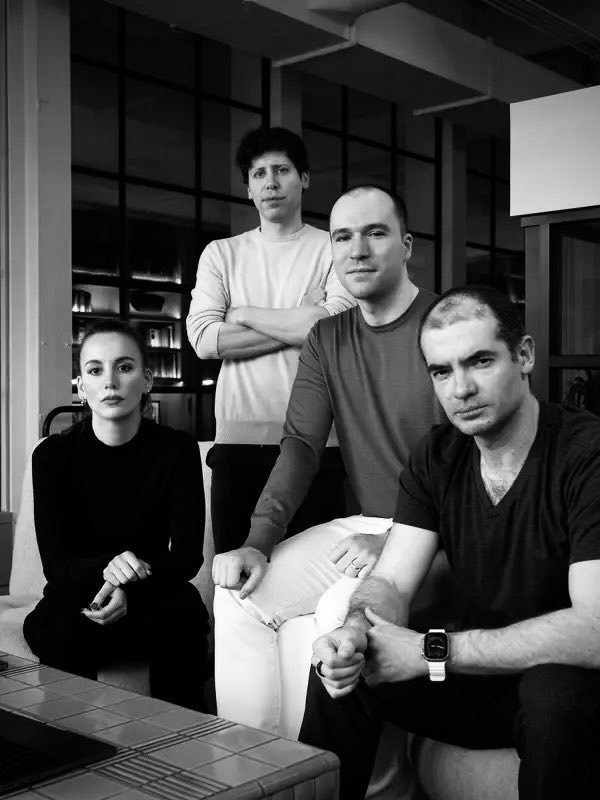

# OpenAI政變事件與機器人三大法則

OpenAI 的執行長 Altman 與董事長 Grag 被 Ilya 為主的董事會成員決定開除

結果在一天後，微軟 CEO 說將會延攬 Altman 與 Grag 成立 AI 部門

然後 OpenAI 的員工， 750 人裡面，有 743 位連署，要求董事會下台，否則就要集體跳巢到微軟的 AI 部門。

這件事如果真的是 Ilya 因為 AI 的安全問題而發動的，那麼到底該安全問題是甚麼？

據消息稱， Ilya 是因為 Super Alignment 技術尚未成功，Altman 就將 ChatGPT 公開，兩人開始逐漸產生分歧

那麼甚麼是 Super Alignment 呢？

根據我看到的資訊，應該是控制 AI ，讓 AI 與人類目標相一致，不會危害人類的一種技術 ...

或者可以說，是深度學習領域的《機器人三大法則》 

1. 機器人不得傷害人類，或坐視人類受到傷害；
    * A robot may not injure a human being or, through inaction, allow a human being to come to harm.
2. 機器人必須服從人類命令，除非命令與第一法則發生衝突；
    * A robot must obey the orders given it by human beings except where such orders would conflict with the First Law.
3. 在不違背第一或第二法則之下，機器人可必須保護自己。
    * A robot must protect its own existence as long as such protection does not conflict with the First or Second Law.

由於現在深度學習有所謂的《幻覺》問題，而且我們很難對《神經網路》進行控制，所以目前 Super Alignment 應該還沒辦法做到很好的控制。

在艾西莫夫的科幻世界裡，即使完全遵守三大法則的機器人，最後通常還是會出問題 (像是決定讓大多數人受害，而去保護單一個人)。

於是後來又有了《第零法則》

* 第零法則： 機器人不得傷害整體人類，或坐視整體人類受到傷害
    * A robot may not harm humanity, or, by inaction, allow humanity to come to harm.

這條法則不能放在第四條，因為是按優先順序排的，所以只好加在第零條 ...

OpenAI 的事件，似乎讓我們必須開始面對真實世界的《機器人三大法則》了 ...

[臉書貼文](https://www.facebook.com/ccckmit/posts/pfbid0KoiofX7jHAHVNTcAPVFpAVzGK7CMzgPTmQ4mGuo5DZgp3CzN9hs778euttpEsy7xl)

後來 Twitter (X) 上 Ilya 與 Altman 有個互動如下：

這代表 Ilya 真的是為了安全問題才發動這場政變的嗎？

