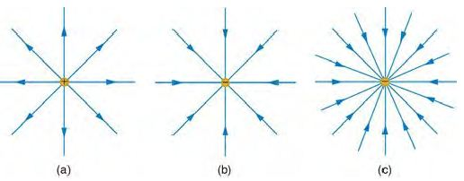
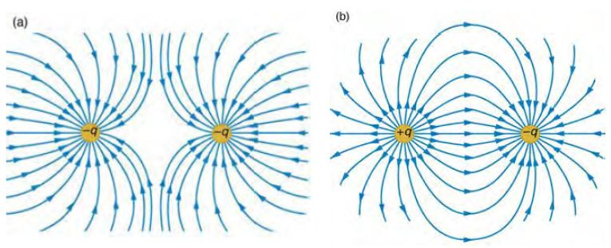
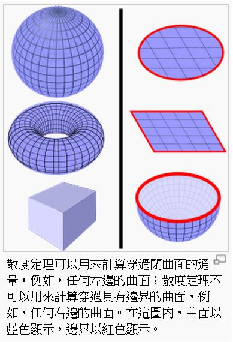
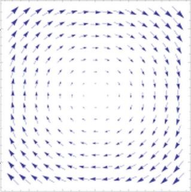
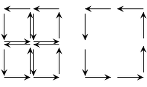

## 電磁學基礎 (2) -- 向量微積分 (作者：陳鍾誠)

在上一期當中，我們已經介紹了電磁學的一些基本概念，該文網址如下：

* [電磁學基礎 (1) -- 關於電磁場的一些疑問？](./關於電磁場的一些疑問)

在本期當中，我們將會說明電磁學的理論基礎，特別是有關向量微積分的部份。

### 前言

為了要描述「力場、電場、磁場」等這些概念，物理學家與數學家發展出了通用的「向量場」觀念，
這些觀念與微積分中的「無窮小」概念整合後，就發展出了「通量、環量、散度、旋度」等等數學
描述，透過這些數學描述，我們就能更快速的進入「馬克斯威」的電磁理論領域。

### 通量與散度

在一個向量場當中，通量是指通過某個表面的向量總數，通常用積分的方式累加計算，例如在以下的圖 (a) 中，由於該粒子帶正電，會對其它正電粒子產生排斥力，因此其電場是向外發射的，於是若我們在電子外部加一個包覆球面，
那麼通過該球面的電通量就會是正的，而且電通量大小就會是該粒子的電量大小。

同樣的、在圖 (b) 中由於粒子帶負電，會對其它正電粒子產生吸引力，因此其電場是向內集中的，所以通過包覆球面的電通量就會是負的。

如果該帶電粒子的電量較大，那麼我們通常會把電場線畫多一點，這種較密集的電場線在視覺上可以強調哪一部份的電場較強，
如以上的圖 (c) 所示。

看過這個範例，我們就可以來正式定義「通量」的概念了。

> 定義：通量
> 
> $\Phi_F(S) = \int_{S} F \cdot \vec{ds}$ 
> 
> 直覺意義：
> 
> 1. F 是一個向量場 (例如電場)，S 是一個曲面。
> 
> 2. $F \cdot \vec{ds}$ 代表向量場與曲面法向量的內積。
> 
> 3. 向量場 F  與整個曲面 S 的法向量內積總和，即是通量。
> 
> 4. 通量大於零 (通量 > 0) 代表有向外發射的傾向。
> 
> 5. 通量小於零 (通量 < 0) 代表有向內匯集的傾向。

在以上的定義當中，曲面 S 並沒有要求是封閉的 (像汽球一樣)，但是假如 S 是一個封閉曲面，那麼我們通常會用以下的環狀積分來代表這種封閉的情況。

$\Phi_F(S) = \oint_{S} F \cdot \vec{ds}$

對於電場而言，通常我們在意的是環狀曲面的通量，因此可以用上述環狀積分符號  來表示此種情況。

通量的概念不只適用於一個粒子產生的電場，而是任何的電場都可以適用的。例如以下是兩個粒子所產生的電場，其中圖 (a) 是兩個負電粒子所產生的電場，所以如果在兩者之外定義一個封閉曲面，那麼其電通量將會是這兩個粒子的負電量總合。

同樣的，如果是像圖 (b) 這樣一正一負的兩個粒子，那麼通過外部封閉曲面的電通量，將會因為正負相互抵消而變成零。

如果、我們想用微積分的概念，透過很多微小區塊的積分來計算通量總合的話，那麼我們就可以定義一個非常微小區域的通量密度，這種逼近無限小的平均通量概念，就稱為散度。其定義如下：

> 定義：散度
> 
> $\operatorname{div} \mathbf{F} = \nabla \cdot \mathbf{F} = \lim_{S \to 0} \frac{\oint_{S} F \cdot \vec{ds}}{V}$ 
> 
> 直覺意義：
> 
> 1. F 是一個向量場 (例如電場)，S 是一個封閉曲面，V 是封閉曲面所包圍的體積。
> 
> 2. $F \cdot \vec{ds}$ 代表向量場與曲面法向量的內積。
> 
> 3. $\oint_{S} F \cdot \vec{ds}$ 代表封閉曲面 S 的通量。
> 
> 4. 散度是發散點或內聚點的衡量值。
> 
> 5. 發散點箭頭向外散射（散度 > 0)。
> 
> 6. 內聚點箭頭向內聚射 (散度 < 0)。
> 
> 7. 散度是單一點的通量密度。

如果某一點的散度大於 0，代表那個點向外射出的向量比向內射入的多，如果小於零則代表向內射入的向量比向外射出的多。

> 定理：散度定理，又稱「高斯散度定理」。
> 
> $\int_{V} (\nabla \cdot F) dv = \oint_{S} F \cdot \vec{ds}$ 
> 
> 直覺意義：
> 
> 1. V 是空間中的一個區域，而 S 是 V 的表面。
> 
> 2. V 區域的散度積分 $\int_{V} (\nabla \cdot F) dv$ ，等於向量場 F 對 S 的面積分 $ \oint_{S} F \cdot \vec{ds}$ 。
> 
> 3. 在電磁學中，這代表我們只要計算通過 S 曲面的向量積分 $ \oint_{S} F \cdot \vec{ds}$ ，就可以知道 V 區域裏面帶有多少電量。反過來說、只要知道 V 區域帶有多少電量，就知道通過其表面的電力線總共有多少。

散度定理的證明想法：對於曲面內部的兩個相鄰小立方體 A, B 而言，這些向量直接穿過相鄰面，所以從 A 射出的向量與 B 射入的向量互相抵消，因此只有最外圍的那一面才不會被抵銷，因此只要算最外層表面的向量加總就可以了。

所以散度定理只適用於封閉曲面 (如上圖左半邊的情況)，但對於開放曲面  (如上圖右半邊的情況) 則不適用。

### 在迪卡兒座標系統內的通量與散度

在迪卡兒座標系統內，我們可以用下列函數來描述一個向量場

$\mathbf{F}(x,y,z)=P(x,y,z)\mathbf{i}+Q(x,y,z)\mathbf{j}+R(x,y,z)\mathbf{k}$ 

上式代表空間中的每一個點 (x,y,z) 都有一個向量 P(x,y,z)i+Q(x,y,z)j+R(x,y,z)k
附著於該點上，其中的 i,j,k 分別是 x 軸、y 軸、z 軸方向上的單位向量，也就是 i=(1,0,0), j=(0,1,0), k=(0,0,1)。

那麼、所謂的某一個點的散度，在三維迪卡兒座標系統 (直角坐標系統) 內其實是向量場 F 在 (x,y,z) 這點的三個偏微分值加總。

$\nabla\cdot\mathbf{F}=\frac{\partial P}{\partial x}+\frac{\partial Q}{\partial y}+\frac{\partial R}{\partial z}$ 

換句話說，在三維迪卡兒座標系統內，以下等式是成立的：

$\nabla \cdot \mathbf{F} = \lim_{S \to 0} \frac{\oint_{S} F \cdot \vec{ds}}{V} =\frac{\partial P}{\partial x}+\frac{\partial Q}{\partial y}+\frac{\partial R}{\partial z}$ 

由於上式看起來等號兩邊並沒有直接關係，因此讀者必然感到奇怪，但是受限於筆者的數學能力，恐怕無法進行正式的證明，因此我們簡要的寫出「證明想法」如下。

證明想法：(非正式證明)

> $\nabla \cdot \mathbf{F} = \lim_{S \to 0} \frac{\oint_{S} F \cdot \vec{ds}}{V}$ ; 根據散度定義
> 
> $=\lim_{S \to 0} \frac{\oint_{S} (P(x,y,z) i + Q(x,y,z) j + R(x,y,z) k) \cdot (dy dz i + dx dz j + dx dy k)}{\Delta x \Delta y \Delta z}$  ; 根據下表的微量面積算式
> 
> $=\lim_{S \to 0} \frac{(P(x_0,y_0,z_0) \Delta y \Delta z + Q(x_0,y_0,z_0) \Delta x \Delta z + R(x_0,y_0,z_0) \Delta x \Delta y)}{\Delta x \Delta y \Delta z}$ ; 根據均值定理，S 內部必然有個點 $(x_0, y_0, z_0)$ 滿足此式
> 
> $=\lim_{S \to 0} \frac{P(x,y,z)}{\Delta x} + \frac{Q(x,y,z)}{\Delta y} + \frac{R(x,y,z)}{\Delta z}$  ; 因為 S 無限小，所以 $x_0 \to x, y_0 \to y, z_0 \to z$ 。
> 
> $=(\partial P(x,y,z)/\partial x) + (\partial Q(x,y,z)/\partial y) + (\partial R(x,y,z)/\partial z)$ .

說明：上述陳述的證明想法，牽涉到「微量長度、微量面積、微量體積」的表示方法，如下所示：

| 微量極限 | 簡要概念 | 數學定義 | 說明 | 
|--|--|--|
| 微量體積 | $dv =dx dy dz$ | $\lim_{\Delta V \to 0} \Delta v = \lim_{\Delta V \to 0} (\Delta x \Delta y \Delta z)$ | 無方向性、純量表示法 |
| 微量長度 | $\vec{dl} = dx i + dy j + dz k$ | $\lim_{\Delta l \to 0} \Delta l = \lim_{\Delta l \to 0} (\Delta x \mathbf{i} + \Delta y \mathbf{j} + \Delta z \mathbf{k})$ | 有方向性、向量表示法 |
| 微量面積 | $\vec{ds} = dy dz i + dx dz j + dy dz k$ | $\lim_{\Delta s \to 0} \Delta s = \lim_{\Delta s \to 0} (\Delta y \Delta z \mathbf{i} + \Delta x \Delta z \mathbf{j} + \Delta x \Delta y \mathbf{k})$ | 有方向性、向量表示法 | 

注意：在迪卡兒座標系中，向量場 F 的散度為 $\frac{\partial P}{\partial x}+\frac{\partial Q}{\partial y}+\frac{\partial R}{\partial z}$ ，但這個算式其實是 $(\frac{\partial P}{\partial x}, \frac{\partial Q}{\partial y}, \frac{\partial R}{\partial z}) \cdot (1, 1, 1)$ 的內積值，因此數學上才會用類似內積的 $\nabla \cdot F$ 符號代表散度。

### 環量與旋度

環量與旋度是用來計算環繞著某個封閉曲線的旋轉力量強度，以下是一個環狀向量場的圖示範例：

為了衡量向量場的這種旋轉強度，數學家們定義了環量這個概念。

> 定義：環量
> 
> $\operatorname{Circ}_{\mathbf{F}}(C) =\oint_{C}\mathbf{F}\cdot \vec{d l}$ 
> 
> 直覺意義：
> 
> 1. F 是一個向量場 (例如磁場)，C 是一條封閉曲線， $\vec{d l}$ 是曲線邊緣的切線向量。
> 
> 2. 環量和通量一樣，是描述向量場的重要參數，但環量描述的是旋轉的力量總和，而通量描述的是吸引與排斥的力量總和。
> 
> 3. 某個區域中的環量不等於零，說明這個區域中的向量場表現出環繞某一點或某一區域旋轉的特性。

為了描述一個向量場 F 在一點附近的環量，將閉合曲線 C 收小，使它包圍面的面積 U 趨於零時，可以得到一個平均環量強度的極限值，這個平均環量強度就稱為該點的旋度。

> 定義：旋度
> 
> $\nabla \times F = \beta \cdot \mathbf{n}  = (\lim_{C \to 0} \frac{\oint_{C}\mathbf{F}\cdot \vec{d l}}{U}) \cdot \mathbf{n}$ 
> 
> 直覺意義：
> 
> 1. F 是一個向量場 (例如磁場)，C 是一條極小的封閉曲線，U 是 C 所包圍的面積大小。
> 
> 2. 旋度是環量範圍 C 趨近於零的結果，是某一點的環量除以面積的極限值 (環量密度)。
> 
> 3. 旋度代表被 C 包圍的那一點在方向 $\mathbf{n}$ 上的旋轉強度。
> 
> 4. 旋度與方向 $\mathbf{n}$ 有關，在不同的方向旋度也不同。

雖然旋度與散度一樣都是個純量，但是旋度卻必須指定方向 $\mathbf{n}$ 才有辦法計算，因此隨著方向 $\mathbf{n}$  的不同，得到的旋度也會有所不同。

### 散度與旋度定理

> 定理：旋度定理、又稱「斯托克定理 (Stokes theorem)」
> 
> $\int_{S} (\nabla \times F) \cdot \vec{ds} = \oint_{C} F \cdot \vec{dl}$ 
> 
> 直覺意義：
> 
> 1. S 是空間中的一個曲面，而 C 是環繞 S 邊緣的封閉曲線。
> 
> 2. S 曲面上的旋度總和 $\int_{S} (\nabla \times F) \cdot \vec{ds} $ ，等於S 邊緣任一封閉曲線 C 的線積分 $ \oint_{C} F \cdot \vec{dl}$ 。

斯托克定理的證明想法：在下圖中，S 曲面內方格的共用邊向量會互相抵消，於是只要計算延著邊緣環繞線 C 的向量內積總和 $\oint_{C} F \cdot \vec{dl}$ ，就可以算出整體的環量 $\int_{S} (\nabla \times F) \cdot \vec{ds}$ 。

### 馬克斯威方程式

在電磁學上，有四個重要的物理量，分別是 - 電場 (E)、磁場 (H)、電通量 (D) 與磁通量 (B) 等，這四個物理量之間可形成四條重要的物理學關係式，這四條關係式便是著名的馬克斯威方程式。

以下是這四個物理量之間的關係式：

| 符號 | 對應的物理量 (四個符號均代表向量場) | 與其他符號間的關係式 |
|------|-------------------------------------|----------------------|
| E    | 電場強度 (Electric field intensity) | $\vec{D} = \epsilon \vec{E}$ ; 其中 $\epsilon$ 為介電率 |
| H    | 磁場強度 (Magnetic field intensity) | $\vec{B} = \mu \vec{H}$ ; 其中 $\mu$ 為導磁率  |
| D    | 電通量密度 (Electric flux density)  | $D=\nabla \cdot E = \lim_{S \to 0} \frac{\oint_{S} E \cdot \vec{ds}}{V}$ |
| B    | 磁通量密度 (Magnetic flux density)  | $B=\nabla \cdot H = \lim_{S \to 0} \frac{\oint_{S} H \cdot \vec{ds}}{V}$ |

當初馬克斯威寫下的方程式，由於沒有使用「散度」與「旋度」這樣的算子，因此描述起來較為複雜，每個方程式都會寫成一組包含好幾個微分方程式的複雜寫法。但是有了上述的數學概念之後，我們就可以用「散度」與「旋度」這樣的算子，更簡單的描述馬克斯威方程式了。
以下是使用散度與旋度描述的馬克斯威方程式。

定律 			| 微觀公式 (使用散度、旋度)   | 巨觀公式 (使用通量、環量) | 說明
----------------------|---------------------------|------------------------|------
法拉第定律 	| $\nabla \times \mathbf{E} = -\frac{\partial \mathbf{B}} {\partial t}$ | $\oint_{\mathbb{L}}\ \mathbf{E} \cdot \vec{dl}  = - \frac {\mathrm{d} \Phi_\mathbf{B}}{\mathrm{d} t}$ | 磁通量 B 的變化會產生感應電場 E
安培定律 		| $\nabla \times \mathbf{H} = \mathbf{J} + \frac{\partial \mathbf{D}} {\partial t}$ | $\oint_{\mathbb{L}}\ \mathbf{H} \cdot \vec{dl} = I_{f} + \frac {\mathrm{d} \Phi_\mathbf{D}}{\mathrm{d} t}$ | 電流 J 與電通量變化 $\frac{\partial \mathbf{D}} {\partial t}$  會產生磁場 H
高斯定律 		| $\nabla \cdot \mathbf{D} = \rho$ | $\oint_{S} D\cdot\vec{ds} = Q_{f}$ | 電荷密度 $\rho$ 決定電通量 D
自然定律 		| $\nabla \cdot \mathbf{B} = 0$ | $\oint_{S} B\cdot\vec{ds} = 0$ | 進入任一區域的磁通量一定等於出去的磁通量

如果是在相同的介質當中，上述方程式裏的介電率 $\epsilon$ 與導磁率 $\mu$ 就會是固定的，此時整個馬克斯威方程式就可以進一步簡化為下列兩條：

定律 			| 公式 					| 說明
----------------------|---------------------------------------|------
法拉第定律 	| $\nabla \times \mathbf{E} = - \mu \frac{\partial \mathbf{H}} {\partial t}$ | 磁場強度 H 的變化會產生感應電場 E
安培定律 		| $\nabla \times \mathbf{H} = \mathbf{J} + \epsilon \frac{\partial \mathbf{E}} {\partial t}$ | 電流 J 與電場強度 E 的變化 $\frac{\partial \mathbf{E}} {\partial t}$  會產生磁場 H

於是「法拉第定律」與「安培定律」就成了電磁學裏最重要的兩條方程式。

如果將上述相同介質中「法拉第定律」的「散度」與「旋度」等算子 ( $\nabla \cdot$ , $\nabla \times$ ) 給還原，然後再將每個方向的分量都寫出來，那麼上述的  $\nabla \times \mathbf{E} = - \mu \frac{\partial \mathbf{H}} {\partial t}$ 算式就可以改寫為下列向量場方程式：

> $(\frac{\partial E_z}{\partial y} - \frac{\partial E_y}{\partial z}) i + (\frac{\partial E_x}{\partial z} - \frac{\partial E_z}{\partial x}) j + (\frac{\partial E_y}{\partial x} - \frac{\partial E_x}{\partial y}) k = - \mu (\frac{\partial H_x}{\partial t} i + \frac{\partial H_y}{\partial t} j + \frac{\partial H_z}{\partial t} k)$ 

同樣的、安培定律 $\nabla \times \mathbf{H} = \mathbf{J} + \epsilon \frac{\partial \mathbf{E}} {\partial t}$ 也可以改寫為以下的向量場方程式：

> $(\frac{\partial H_z}{\partial y} - \frac{\partial H_y}{\partial z}) i + (\frac{\partial H_x}{\partial z} - \frac{\partial H_z}{\partial x}) j + (\frac{\partial H_y}{\partial x} - \frac{\partial H_x}{\partial y}) k = (J_x + \epsilon \frac{\partial E_x}{\partial t}) i + (J_y + \epsilon \frac{\partial E_y}{\partial t}) j + (J_z + \epsilon \frac{\partial E_z}{\partial t}) k$ 

而上述的這種寫法也就是當初「馬克斯威」所寫的方程式形態，這種型態的方程式經過「黑維塞」用 ( $\nabla \cdot$ , $\nabla \times$ ) 等算子重新詮釋之後，就成了表格中您所看到的簡潔版本了。

根據上述的馬克斯威方程組，我們可以看到介電率和磁導率是兩個重要的常數，通常介電率用符號 $\epsilon$ 表示，而磁導率
用符號 $\mu$ 表示。

介電率是介質響應外加電場的極化的衡量值，介電率的測量單位是法拉／公尺（Farad/meter，F/m）。真空狀態的介電率 (「真空介電常數」) 的數值是 $\varepsilon_0 ==8.854187817 \times 10^{12} F/m$

磁導率是一種材料對一個外加磁場線性反應的磁化程度。磁導率 $\mu$ 的單位是亨利每米（H/m），或牛頓每安培的平方（ $N/A^2$ ）。而真空狀態的磁導率為 $\mu_0 = 4 \pi \times 10^{-7} N/A^2$ 。

### 波動方程式

以下的向量場微分方程式可以用來描述電磁波的傳遞行為，因此稱為波動方程式 (其中的 E 代表電場，是個向量場)。

$\nabla^2 E = \mu \epsilon \frac{\partial^2 E}{\partial t^2}$

根據上述的波動方程式 ，電磁波的速度為 $\sqrt{\mu \epsilon}$ ，在真空狀態下，電磁波的速度等於 $\sqrt{\mu_0 \epsilon_0}=8.854187817 \times 10^{12} \times 4 \pi \times 10^{-7} = 3 \times 10^8 m$ ，也就是光速，這個現象讓馬克斯威直覺的推論出「光是一種電磁波」。

那麼、波動方程式是怎麼來的呢？

這個問題的解答，當然是從馬克斯威方程延伸推論而來的，我們只要利用相同介值中的法拉第定律與安培定律，也就是下列兩條，就可以導出波動方程式了。

定律 			| 公式 					| 說明
------------------------|---------------------------------------|------
法拉第定律 	| $\nabla \times \mathbf{E} = - \mu \frac{\partial \mathbf{H}} {\partial t}$ | 磁場強度 H 的變化會產生感應電場 E
安培定律 		| $\nabla \times \mathbf{H} = \mathbf{J} + \epsilon \frac{\partial \mathbf{E}} {\partial t}$ | 電流 J 與電場強度 E 的變化 $\frac{\partial \mathbf{E}} {\partial t}$  會產生磁場 H

> 推導：波動方程式
> 
> 根據上述的法拉第定律與安培定律，可推得下列結果
> 
> $\nabla \times (\nabla \times \mathbf{E}) = \nabla \times (- \mu \frac{\partial \mathbf{H}} {\partial t})=- \mu \frac{\partial}{\partial t} (\nabla \times \mathbf{H})= - \mu \frac{\partial}{\partial t} (\mathbf{J} + \epsilon \frac{\partial \mathbf{E}} {\partial t})$ ; 
> 
> 接著假設電流密度為零 $J=0$ ，於是得到
> 
> $\nabla \times (\nabla \times \mathbf{E}) = - \mu \frac{\partial}{\partial t} (\epsilon \frac{\partial \mathbf{E}} {\partial t})$ ; 
> 
> 接著根據迪卡兒座標系統中的 curl of curl 定理 $\nabla \times (\nabla \times E) = \nabla (\nabla \cdot E) - \nabla^2 E$ ，可得下式
> 
> $\nabla (\nabla \cdot E) - \nabla^2 E =  - \mu \epsilon \frac{\partial^2 \mathbf{E}} {\partial t^2}$ ; 
> 
> 接著假設電荷密度為零 $\rho=0$ ，那麼根據 $\nabla \cdot D=\rho=0$ 可推論 $\nabla \cdot E=0$ ，於是得到：
> 
> $\nabla^2 E = \mu \epsilon \frac{\partial \mathbf{E}} {\partial t}$ ; 這就是波動方程式了。

接著、我們就可以根據波動方程式推論電磁波的傳遞速度，讓我們用一個範例來看看這個推論：

> 範例：假設電場 E = P(x,y,z) i + Q(x,y,z) j + R(x,y,z) k ，其中 $P(x,y,z)=A sin(\omega t - c z)$ ，而 Q, R 均為 0，那麼那麼請問 c 是多少才會符合波動方程式的解。
> 
> 解答：
> 
> $E=A sin(\omega t - c z)i+0j+0k$ ;
> 
> $\nabla^2 E = \frac{\partial P(x,y,z)}{\partial x}+0+0 = -A c^2 sin(\omega t - c z)$ ; 
> 
> $\frac{\partial \mathbf{E}} {\partial t} = -A \omega^2 sin(\omega t - c z)$ ;
> 
> 接著根據波動方程式 $\nabla^2 E = \mu \epsilon \frac{\partial \mathbf{E}} {\partial t}$ ，可以得到下式：
> 
> $\nabla^2 E = -A c^{2} sin(\omega t - c z)=\mu \epsilon (-A \omega^2 sin(\omega t - c z))=\mu \epsilon \frac{\partial \mathbf{E}} {\partial t}$ ;
> 
> 所以可以推論 $c^2=\omega^2 \mu \epsilon$  . 

因此、上述範例中的電場之函數如下：

> $E=A \sin(\omega t - c z)i+0j+0k$ ;
> 
> $=A \sin(\omega (t - \sqrt{\mu \epsilon} z))i+0j+0k$ .

這代表 E 為一個往 z 軸方向行進的電磁波，其振幅為 A，而頻率為 $\omega$ ，且行進速度為 $ \frac{1}{\sqrt{\mu \epsilon}}$ 。

說明：上述電場波動的振幅為 A，頻率為 $\omega$ 是比較容易理解的，學過 sin, cos 等三角函數的人應該可以輕易理解。
但是為何行進速度為 $\sqrt{\mu \epsilon}$ 呢？

如果您想像一個海浪，正往右方打去，那麼該海浪的速度為多少呢？一個直覺的看法是看波峰走的距離，然後除以花費的時間就得到速度。

同樣的，對於 $A \sin(\omega (t - \sqrt{\mu \epsilon} z))i+0j+0k$ 這個波而言，如果在 t 時間波峰在 z，且在 t+dt 
這個時間點波峰在 z+dz，那麼我們就可以用 dz/dt 來計算波速。而要保持某點在正弦波上的位置不變，方法就是用 
$\sqrt{\mu \epsilon} z$ 去抵銷 t 所造成的功效，也就是兩者都在波峰、或者兩者都在波谷的情況。

因此該電磁波的速度就是滿足 $t - \sqrt{\mu \epsilon} z=0$ 的情況，於是我們可以得到：

> $t - \sqrt{\mu \epsilon} z = K$ ; 在某個時間 t，位置 z 處的電場大小為 $sin(\omega K)$ 
> 
> $t+dt - \sqrt{\mu \epsilon} (z+dz) = K$ ; 在經過 dt 時間後，我們希望看到那個同樣大小的 $sin(\omega K)$ 向量移動到 z+dz。
> 
> $t+dt - \sqrt{\mu \epsilon} (z+dz) - (t - \sqrt{\mu \epsilon} z) = 0$ ; 也就是該電場大小不變，但是位置從 z 移到了 z+dz。
> 
> $dt = \sqrt{\mu \epsilon} dz$ ; 於是我們找出 dt 與 dz 的關係式。
> 
> $dz/dt = \frac{1}{\sqrt{\mu \epsilon}}$  ; 也就是速度為 $\frac{1}{\sqrt{\mu \epsilon}}$ . 

而且、我們知道在真空中，介電率 $\mu_0$ 與 $\epsilon_0$ 代入後，該速度 $\frac{1}{\sqrt{\mu_0 \epsilon_0}}$ 恰好為光速，
這也正是馬克斯威推論光波為一種電磁波的原因。

### 參考文獻
* [College Physics], OpenStax College.
* Wikipedia:[James Clerk Maxwell](http://en.wikipedia.org/wiki/James_Clerk_Maxwell)
* 維基百科：[馬克士威方程組](http://zh.wikipedia.org/zh-tw/%E9%BA%A6%E5%85%8B%E6%96%AF%E9%9F%A6%E6%96%B9%E7%A8%8B%E7%BB%84)
* 維基百科：[詹姆斯·克拉克·馬克士威](http://zh.wikipedia.org/wiki/%E8%A9%B9%E5%A7%86%E6%96%AF%C2%B7%E5%85%8B%E6%8B%89%E5%85%8B%C2%B7%E9%BA%A6%E5%85%8B%E6%96%AF%E9%9F%A6)
* 維基百科：[論法拉第力線]
* 維基百科：[論物理力線]
* 維基百科：[電磁場的動力學理論]
* 維基百科：[麥克斯韋關係式](http://zh.wikipedia.org/wiki/%E9%BA%A6%E5%85%8B%E6%96%AF%E9%9F%A6%E5%85%B3%E7%B3%BB)
* 維基百科：[旋度](http://zh.wikipedia.org/wiki/%E6%97%8B%E5%BA%A6)
* 維基百科：[散度](http://zh.wikipedia.org/wiki/%E6%95%A3%E5%BA%A6)
* 維基百科：[電容率](http://zh.wikipedia.org/wiki/%E7%94%B5%E5%AE%B9%E7%8E%87)
* 維基百科：[磁導率](http://zh.wikipedia.org/wiki/%E7%A3%81%E5%AF%BC%E7%8E%87)
* 線代啟示錄：[梯度、旋度與散度](http://ccjou.wordpress.com/2013/06/27/%E6%A2%AF%E5%BA%A6%E3%80%81%E6%97%8B%E5%BA%A6%E8%88%87%E6%95%A3%E5%BA%A6/)

[論法拉第力線]:http://zh.wikipedia.org/wiki/%E8%AB%96%E6%B3%95%E6%8B%89%E7%AC%AC%E5%8A%9B%E7%B7%9A
[論物理力線]:http://zh.wikipedia.org/wiki/%E8%AB%96%E7%89%A9%E7%90%86%E5%8A%9B%E7%B7%9A
[電磁場的動力學理論]:http://zh.wikipedia.org/wiki/%E9%9B%BB%E7%A3%81%E5%A0%B4%E7%9A%84%E5%8B%95%E5%8A%9B%E5%AD%B8%E7%90%86%E8%AB%96
[Experimental Researches in Electricity]:http://www.gutenberg.org/files/14986/14986-h/14986-h.htm

【本文由陳鍾誠取材並修改自 [維基百科] 與 OpenStax College 的 [College Physics] 一書，採用創作共用的 [姓名標示、相同方式分享] 授權】

