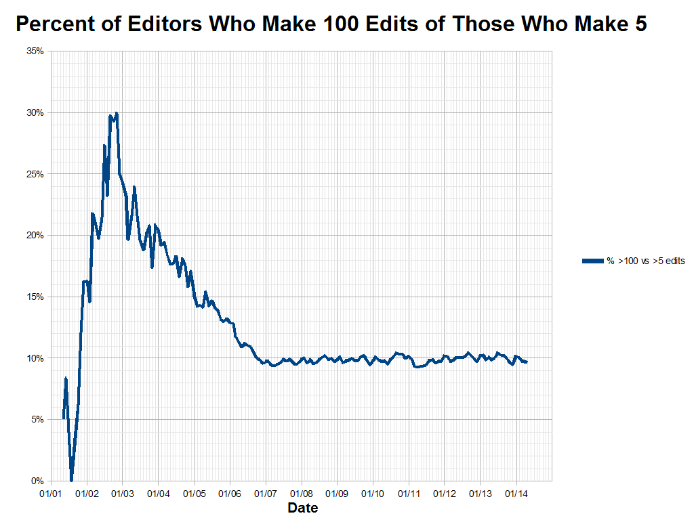

```paper
title: "A method of xxx to do ooo",
abstract: "A method of xxx to do ooo with yyy. A method of xxx to do ooo with yyy. A method of xxx to do ooo with yyy. A method of xxx to do ooo with yyy. A method of xxx to do ooo with yyy. 
A method of xxx to do ooo with yyy. A method of xxx to do ooo with yyy. 
A method of xxx to do ooo with yyy. A method of xxx to do ooo with yyy. A method of xxx to do ooo with yyy. ",
author: "ccc",
keywords: "文件,期刊,xxx",
```

## Introduction

see [misavo](http://misavo.com)

## Related Works 文獻回顧

如文獻 [1](#ccc2019), [2](#kour2014fast) 所說的，....



## Our Method

$$
\int_0^{x} f(x) dx
$$

inline: $\int_0^{x} f(x) dx$


```js
function add(a,b) {
  return a+b
}
```

## Experiment

以下是實驗結果，請參考表格 1。

field | value
------|------------
xxxx  | yyyy
xxxx  | yyyy
xxxx  | yyyy
xxxx  | yyyy
xxxx  | yyyy
xxxx  | yyyy
xxxx  | yyyy
xxxx  | yyyy


## Conclusions

So, that's all what his paper about ...


```reference
ccc2019: {
  title: "GitJournal: 基於 git 的期刊出版新模式", 
  author: "陳鍾誠", 
  year: 2019, 
  booktitle: "開源科學期刊 2019 年 9 月號", 
  url:"https://git-journal.github.io/OpenSource/submit/GitJournal.html"
},
hadash2018estimate: {
  title: "Estimate and Replace: A Novel Approach to Integrating Deep Neural Networks with Existing Applications",
  author: "Hadash, Guy and Kermany, Einat and Carmeli, Boaz and Lavi, Ofer and Kour, George and Jacovi, Alon",
  journal: "arXiv preprint arXiv:1804.09028",
  year: 2018,
},
kour2014fast: {
  title: "Fast classification of handwritten on-line Arabic characters", 
  booktitle: "Soft Computing and Pattern Recognition (SoCPaR), 2014 6th International Conference of", 
  author: "Kour, George and Saabne, Raid", 
  year: 2019,
  organization: "IEEE"
}
```
