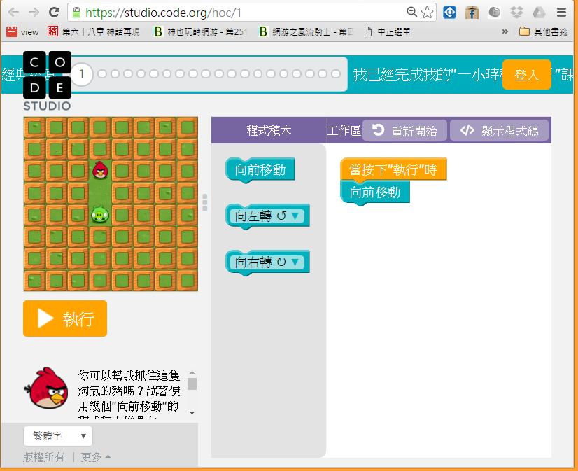
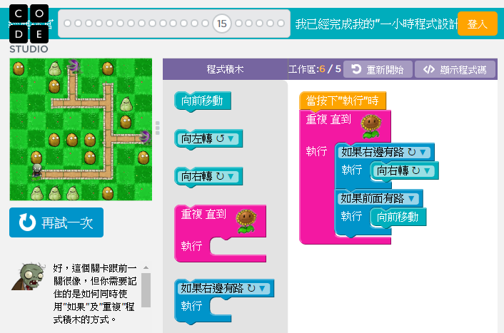

# Hour of Code: 一小時學會圖像式程式設計

現在、就讓我們開始學習寫程式吧！

為了降低難度，我們先利用 code.org 裡的憤怒鳥遊戲，來學習撰寫《視覺化的程式設計》，請先看完下列影片！

* [Hour of Code - Introduction](https://youtu.be/bQilo5ecSX4)

然後開始做『Hour of Code』的練習。

* https://studio.code.org/hoc/1

以下是這個『Hour of Code』練習的第一個畫面！




我曾經在大學資工系的第一堂程式設計上，讓同學們進行上述『Hour of Code』練習，很多同學可以在兩個小時內破完這 20 關。

以下是第 15 關的解答畫面，殭屍成功的找到了向日葵！




如果您按下《顯示程式碼》，會看到以下的 JavaScript 程式，您將會發現其實自己已經學會寫程式了，只不過是採用圖像式的設計方法而已！

```js
while (notFinished()) {
  if (isPathRight()) {
    turnRight();
  }
  if (isPathForward()) {
    moveForward();
  }
}
```

是不是很神奇呢？

但是、真正的程式設計師，通常不能只依靠上述那種《視覺化的設計方法》，而必須要有能力《寫程式》，這就是接下來應該學的事情了，建議可以從 Python 語言開始學習！
