# 機率分布 (連續型)

## 簡介

| 連續機率模型 | 密度函數 | R 函數 | 說明 |
|--------------|----------|--------|------|
| 常態分布(Normal) | $\frac{1}{\sqrt{2\pi} \sigma} e^{- \frac{1}{2} [(x-\mu)/\sigma]^2}$ | norm(mean, sd) | 中央極限定理：x1+x2+...+xk; 當 k 越大就越接近常態分布 | 
| 伽瑪分布 (Gamma) | $\frac{1}{\Gamma(a) b^{a}} x^{a-1} e^{-x/b}$ | gamma(shape, rate = 1, scale = 1/rate) |  $\Gamma(k) = \int_{0}^{\infty} z^{k-1} e^{-z} dz$ <br/>  指數分布與卡方分布都是 Gamma 分布的特例 |
| 指數分布	(Exponential)| $\frac{1}{b} e^{-x/b}$ | exp(rate) | 伽瑪分布($a=1, b=\frac{1}{\lambda}$) <br/> 布瓦松過程中，第一次事件出現的時間 W |
| 卡方分布 (Chi-Square) |  $\frac{1}{2^{\gamma/2}\Gamma(\gamma/2)}\,x^{\gamma/2 - 1} e^{-x/2}$ | chisq(df, ncp) | 伽瑪分布( $b=2, a=\gamma/2$ ) <br/> 利用樣本推斷母體變異數 | 
| 均勻分布 (Uniform) | $\frac{1}{b-a}$ | unif(a:min, b:max) | a:範圍下限, b: 上限 <br/> 出現機會均等 |
| 柯西分布 (Cauchy) | $\frac{1}{\pi} \frac{a}{a^2 + (x-b)^2}$ | cauchy(b:location, a:scale)  | |
| 威布爾分布 (Weibull)| $a b x^{b-1} e^{-a x^{b}}$ | weibull(a:shape, b:scale) | $\rho(t)=\frac{f(t)}{R(t)}$ <br/> 可靠度工程：f(x) 失敗時間, R(t) 可靠度,$\rho(t)$ 失敗率 |
| T 分布 (T)	| $\frac{Z}{\sqrt{X_{\gamma}^2/\gamma}}$ | t(df, ncp) | 估計變異數時使用的分布 | 
| F 分布 (F)	| $\frac{X_{\gamma_1}^2 / \gamma_1}{X_{\gamma_2}^2/\gamma_2}$ |  f(df1, df2, ncp) | 等變異數 F 檢定時使用 | 
| 貝塔分布 (Beta) | $f(x)= \frac{Γ(a+b)}{Γ(a) Γ(b)} x^{a-1}(1-x)^{b-1}$  | beta(a:shape1, b:shape2, ncp) |  | 
| 對數常態分布	 (Log Normal) | |  lnorm(meanlog, sdlog) | | 
| 邏輯分布	| | logis(location, scale)	| |
| Signrank	| | signrank(n)	| |
| 威爾斯	| | wilcox(m, n) | a,b 為兩組樣本 | 

## 均勻分布 (Uniform distribution)

意義：在範圍 (a,b) 內的出現機會均等。

R 函數：[unif(a:min, b:max)](http://sites.stat.psu.edu/~dhunter/R/html/stats/html/Uniform.html)

課本公式：$f(x) = \frac{1}{b-a}$

R 的公式：f(x) = 1/(max-min)

變數意義：a:min 範圍下限, b:max 上限

### R 程式範例

```R
> op=par(mfrow=c(2,2))
> curve(dunif(x, 0, 1), -2, 10)
> curve(dunif(x, 1, 5), -2, 10)
> curve(dunif(x, -1, 9), -2, 10)
> curve(dunif(x, 10, 110), 0, 200)
>
```

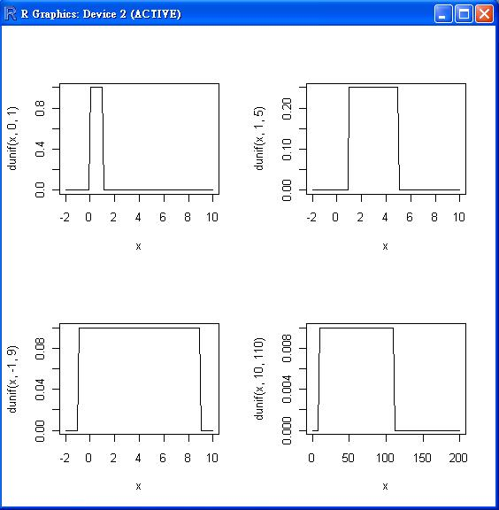

## 常態分布 (Normal Distribution)

意義：有誤差的對稱性分布形式，中央高兩邊低的形式。

繪圖：用 R 繪製標準差為 1, 2, 3, 的常態分布。

```R
curve(dnorm(x), -5, 5, col="black")
curve(dnorm(x, sd=2), -5, 5, col="blue", add=T)
curve(dnorm(x, sd=3), -5, 5, col="green", add=T)
```

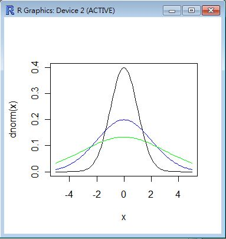

R 函數：[norm(mean, sd)](http://stat.ethz.ch/R-manual/R-patched/library/stats/html/Normal.html)

公式：$\frac{1}{\sqrt{2\pi} \sigma} e^{- \frac{1}{2} [(x-\mu)/\sigma]^2}$

R 的公式：f(x) = 1/(√(2 π) σ) e^-((x - μ)^2/(2 σ^2))

重要性：根據中央極限定理，任何 n 個獨立樣本的平均值趨近於常態分布。

中央極限定理： $x_1+x_2+...+x_n \rightarrow N(\mu, \delta/\sqrt{n})$

### 標準差

1 標準差： $P[-1 \sigma < X-\mu < 1 \sigma] \simeq 0.68$ .

2 標準差： $P[-2 \sigma < X-\mu < 2 \sigma] \simeq 0.95$ .

3 標準差： $P[-3 \sigma < X-\mu < 3 \sigma] \simeq 0.997$ .

```R
> pnorm(1)-pnorm(-1)
[1] 0.6826895
> pnorm(2)-pnorm(-2)
[1] 0.9544997
> pnorm(3)-pnorm(-3)
[1] 0.9973002
> pnorm(4)-pnorm(-4)
[1] 0.9999367
> pnorm(5)-pnorm(-5)
[1] 0.9999994
> pnorm(6)-pnorm(-6)
[1] 1
```

所以現在大家應該知道「工業管理學」上「六標準差」的要求，是很嚴苛的了吧！

### R 程式範例

```R
> dnorm(0)
[1] 0.3989423
> dnorm(0.5)
[1] 0.3520653
> dnorm(2.5)
[1] 0.0175283
> curve(dnorm(x), from = -3.5, to = 3.5, ylab="pdf", main="N(0,1)")
> 
```

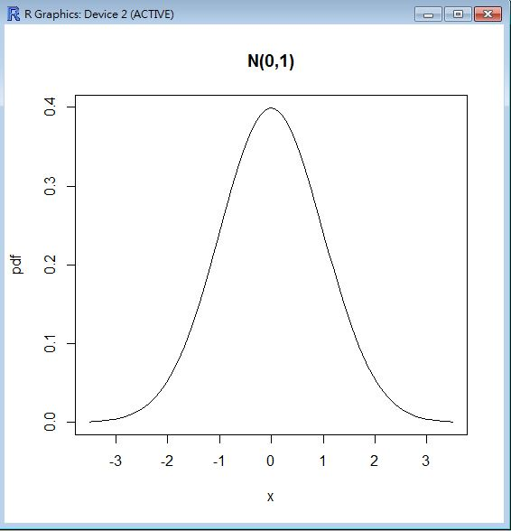

```R
> x = rnorm(100)
> hist(x, nclass=8)
> 
```

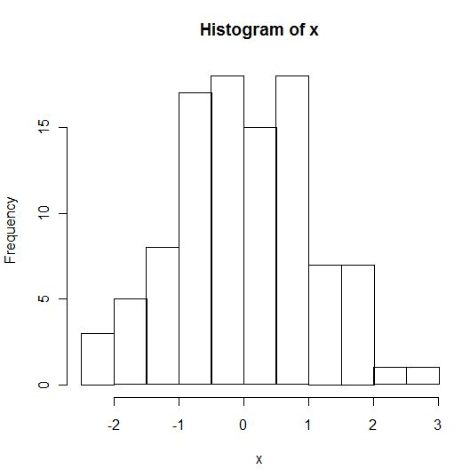

```R
> x = rnorm(1000)
> hist(x, nclass=50)
> 
```

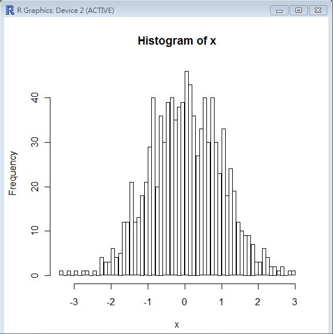

## 伽瑪分布 (Gamma distribution)

$f(x) =  \frac{1}{\Gamma(\alpha) \beta^{\alpha}} x^{\alpha-1} e^{-x/\beta}$

R 的寫法: $gamma(shape=a, rate=s) =  \frac{1}{\Gamma(a) s^a } x^{a-1} e^{-x/s}$


Ｒ函數：Gamma(shape, rate) 

* 公式： f(x)= 1/(s^a Gamma(a)) x^(a-1) e^-(x/s)
* 對應：[$ shape = a = \alpha; scale = s = \beta  $]]
* 意義：指數分布與卡方分布都是 Gamma 分布的特例
* 網址：http://stat.ethz.ch/R-manual/R-patched/library/stats/html/GammaDist.html

Gamma 函數的定義: $\Gamma(k) = \int_{0}^{\infty} z^{k-1} e^{-z} dz$

特性:

1. $E(X) =  \alpha \beta$
2. $Var(X) = \alpha \beta^2$

動差生成函數: $m_x(t) = (1-\beta t)^{-\alpha}$

R 程式範例一

```R
op=par(mfrow=c(2,2))
curve(dgamma(x, 1,1), 0, 10)
curve(dgamma(x, 1,5), 0, 10)
curve(dgamma(x, 5,1), 0, 10)
curve(dgamma(x, 5,5), 0, 10)

```

[=image dgammaCurve4.jpg size="medium"]]

R 程式範例二

```R
-log(dgamma(1:4, shape=1))
p <- (1:9)/10
pgamma(qgamma(p,shape=2), shape=2)
1 - 1/exp(qgamma(p, shape=1))

# even for shape = 0.001 about half the mass is on numbers
# that cannot be represented accurately (and most of those as zero)
pgamma(.Machine$double.xmin, 0.001)
pgamma(5e-324, 0.001)  # on most machines 5e-324 is the smallest
                       # representable non-zero number
table(rgamma(1e4, 0.001) == 0)/1e4
```

執行結果：

```R
> -log(dgamma(1:4, shape=1))
[1] 1 2 3 4
> p <- (1:9)/10
> pgamma(qgamma(p,shape=2), shape=2)
[1] 0.1 0.2 0.3 0.4 0.5 0.6 0.7 0.8 0.9
> 1 - 1/exp(qgamma(p, shape=1))
[1] 0.1 0.2 0.3 0.4 0.5 0.6 0.7 0.8 0.9
> 
> # even for shape = 0.001 about half the mass is on numbers
> # that cannot be represented accurately (and most of those as zero)
> pgamma(.Machine$double.xmin, 0.001)
[1] 0.4927171
> pgamma(5e-324, 0.001)  # on most machines 5e-324 is the smallest
[1] 0.4752741
>                        # representable non-zero number
> table(rgamma(1e4, 0.001) == 0)/1e4

 FALSE   TRUE 
0.5188 0.4812 
> 
```

### 參考文獻
* [Wikipedia:伽瑪分布](http://zh.wikipedia.org/wiki/%E4%BC%BD%E7%8E%9B%E5%88%86%E5%B8%83)
* [Wikipedia:Gamma_distribution](http://en.wikipedia.org/wiki/Gamma_distribution)

## 指數分布 (Exponential Distribution)

$P(X=x) = \frac{1}{\beta} e^{-x/\beta} = \lambda {e}^{- \lambda x}$

* 範圍：x=0,…,k （取出 x 個白球）
* 意義：白球有 m 個，黑球 n 個，取出 k 個球，其中有 x 個白球的機率; (取後不放回)
* R 函數： [$ exp(rate)  ;  rate = 1/\beta = \lambda $]]
 * http://stat.ethz.ch/R-manual/R-patched/library/stats/html/Hypergeometric.html

特性

1. $E(X) =  k (\frac{m}{m+n})$
2. $Var(X) = k (\frac{n}{m+n}) (\frac{m}{m+n}) (\frac{m+n-k}{m+n-1})$


動差生成函數：$m_x(t) = (1-\beta t)^-1$


R 程式範例一

```R
op=par(mfrow=c(2,2))
curve(dexp(x, 1), 0, 10)
curve(dexp(x, 5), 0, 10)
curve(dexp(x, 1/5), 0, 10)
curve(dexp(x, 1/2), 0, 10)

```

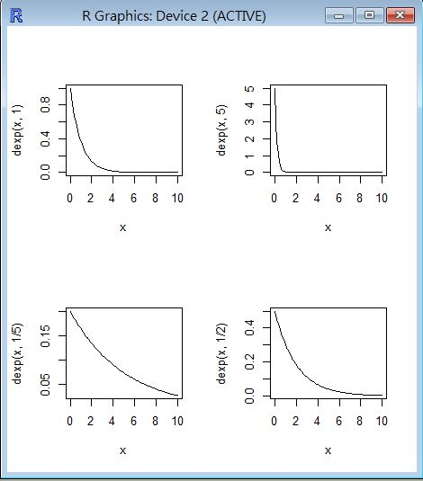

R 程式範例二

```R
> dexp(1) - exp(-1) #-> 0
[1] 0
```

### 參考文獻
* [Wikipedia:指數分布](http://zh.wikipedia.org/wiki/%E6%8C%87%E6%95%B0%E5%88%86%E5%B8%83)
* [Wikipedia:Hypergeometric_distribution](http://en.wikipedia.org/wiki/Hypergeometric_distribution)

## 卡方分布 (Chi-Square distribution)

公式： $\frac{1}{2^{\gamma/2}\Gamma(\gamma/2)}\,x^{\gamma/2 - 1} e^{-x/2}$

R 的公式： $chisq(df=n > 0) =  f_n(x) = \frac{1}{(2^{n/2} \Gamma(n/2)} x^{n/2-1} e^{-x/2}$

Ｒ函數：chisq(df=n, ncp=λ)

* 公式： f(x) = exp(-λ/2) SUM_{r=0}^∞ ((λ/2)^r / r!) dchisq(x, df + 2r)
* 網址：http://stat.ethz.ch/R-manual/R-patched/library/stats/html/Chisquare.html

特性

卡方分配主要用途是在「利用樣本推斷母體變異數」時使用的。

卡方分配是伽瑪分布的特例，只要將 Gamma 分配中設定 $b=2, a=\gamma/2$ 就是卡方分布了。

R 程式範例

```R
op=par(mfrow=c(2,2))
curve(dchisq(x, 1), 0, 100)
curve(dchisq(x, 5), 0, 100)
curve(dchisq(x, 10), 0, 100)
curve(dchisq(x, 50), 0, 100)

```

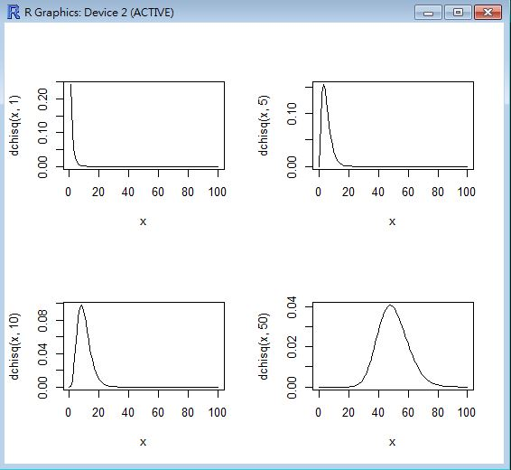

R 程式範例二

```R
dchisq(1, df=1:3)
pchisq(1, df= 3)
pchisq(1, df= 3, ncp = 0:4)# includes the above

x <- 1:10
## Chi-squared(df = 2) is a special exponential distribution
all.equal(dchisq(x, df=2), dexp(x, 1/2))
all.equal(pchisq(x, df=2), pexp(x, 1/2))

## non-central RNG -- df=0 with ncp > 0:  Z0 has point mass at 0!
Z0 <- rchisq(100, df = 0, ncp = 2.)
graphics::stem(Z0)

## Not run: ## visual testing
## do P-P plots for 1000 points at various degrees of freedom
L <- 1.2; n <- 1000; pp <- ppoints(n)
op <- par(mfrow = c(3,3), mar= c(3,3,1,1)+.1, mgp= c(1.5,.6,0),
          oma = c(0,0,3,0))
for(df in 2^(4*rnorm(9))) {
  plot(pp, sort(pchisq(rr <- rchisq(n,df=df, ncp=L), df=df, ncp=L)),
       ylab="pchisq(rchisq(.),.)", pch=".")
  mtext(paste("df = ",formatC(df, digits = 4)), line= -2, adj=0.05)
  abline(0,1,col=2)
}
mtext(expression("P-P plots : Noncentral  "*
                 chi^2 *"(n=1000, df=X, ncp= 1.2)"),
      cex = 1.5, font = 2, outer=TRUE)
par(op)
## End(Not run)

## "analytical" test
lam <- seq(0,100, by=.25)
p00 <- pchisq(0,      df=0, ncp=lam)
p.0 <- pchisq(1e-300, df=0, ncp=lam)
stopifnot(all.equal(p00, exp(-lam/2)),
          all.equal(p.0, exp(-lam/2)))

```

執行結果：

```R
> dchisq(1, df=1:3)
[1] 0.2419707 0.3032653 0.2419707
> pchisq(1, df= 3)
[1] 0.198748
> pchisq(1, df= 3, ncp = 0:4)# includes the above
[1] 0.19874804 0.13229855 0.08787311 0.05824691 0.03853592
> 
> x <- 1:10
> ## Chi-squared(df = 2) is a special exponential distribution
> all.equal(dchisq(x, df=2), dexp(x, 1/2))
[1] TRUE
> all.equal(pchisq(x, df=2), pexp(x, 1/2))
[1] TRUE
> 
> ## non-central RNG -- df=0 with ncp > 0:  Z0 has point mass at 0!
> Z0 <- rchisq(100, df = 0, ncp = 2.)
> graphics::stem(Z0)

  The decimal point is at the |

   0 | 0000000000000000000000000000001122334455668903344577888899999
   2 | 1345667788899234689
   4 | 14813556
   6 | 2477733
   8 | 047
  10 | 3
  12 | 
  14 | 
  16 | 6

> 
> ## Not run: ## visual testing
> ## do P-P plots for 1000 points at various degrees of freedom
> L <- 1.2; n <- 1000; pp <- ppoints(n)
> op <- par(mfrow = c(3,3), mar= c(3,3,1,1)+.1, mgp= c(1.5,.6,0),
+           oma = c(0,0,3,0))
> for(df in 2^(4*rnorm(9))) {
+   plot(pp, sort(pchisq(rr <- rchisq(n,df=df, ncp=L), df=df, ncp=L)),
+        ylab="pchisq(rchisq(.),.)", pch=".")
+   mtext(paste("df = ",formatC(df, digits = 4)), line= -2, adj=0.05)
+   abline(0,1,col=2)
+ }
> mtext(expression("P-P plots : Noncentral  "*
+                  chi^2 *"(n=1000, df=X, ncp= 1.2)"),
+       cex = 1.5, font = 2, outer=TRUE)
> par(op)
> ## End(Not run)
> 
> ## "analytical" test
> lam <- seq(0,100, by=.25)
> p00 <- pchisq(0,      df=0, ncp=lam)
> p.0 <- pchisq(1e-300, df=0, ncp=lam)
> stopifnot(all.equal(p00, exp(-lam/2)),
+           all.equal(p.0, exp(-lam/2)))
> 

```

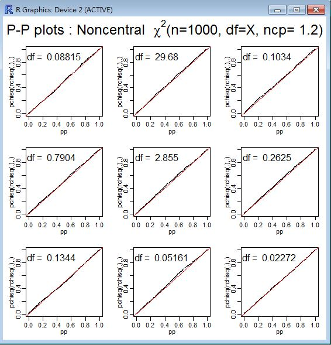

### 參考文獻
* [Wikipedia:卡方分布](http://zh.wikipedia.org/wiki/%E5%8D%A1%E6%96%B9%E5%88%86%E4%BD%88)
* [Wikipedia:Chi-squared_distribution](http://en.wikipedia.org/wiki/Chi-squared_distribution)

## 柯西分布 (Cauchy Distribution)

公式： $\frac{1}{\pi} \frac{a}{a^2 + (x-b)^2}$

Ｒ函數：cauchy(location = 0, scale = 1)

* 公式：f(x) = 1 / (π s (1 + ((x-l)/s)^2))
* 說明：location=l , scale=s 
* 網址：http://stat.ethz.ch/R-manual/R-patched/library/stats/html/Cauchy.html

R 程式範例一

```R
op=par(mfrow=c(2,2))
curve(dcauchy(x, 1,1), 0, 10)
curve(dcauchy(x, 1,5), 0, 10)
curve(dcauchy(x, 5,1), 0, 10)
curve(dcauchy(x, 5,5), 0, 10)
```


## 威布爾分布 (Weibull Distribution)

$\alpha \beta x^{\beta-1} e^{-\alpha x^{\beta}}$

* 用途：(可靠度工程) f(x) 失敗時間, R(t) 可靠度, [$ \rho(t) $]] 失敗率

* Ｒ函數：weibull(a:shape, b:scale)
 * 公式：f(x) = 1 / (π s (1 + ((x-l)/s)^2))
 * 說明：location=l , scale=s 
 * 網址：<http://stat.ethz.ch/R-manual/R-patched/library/stats/html/Weibull.html>

### 特性

* 期望值：$\alpha^{-1/\beta} \rho(1+\frac{1}{\beta})$

* 變異數：$\alpha^{-2/\beta} \rho(1+\frac{2}{\beta}) - \mu^2$

* 動差生成函數： $m_x(t) = ??$

### R 程式範例一

```R
op=par(mfrow=c(2,2))
curve(dweibull(x, 1, 1), 0, 10)
curve(dweibull(x, 1, 5), 0, 10)
curve(dweibull(x, 5, 1), 0, 10)
curve(dweibull(x, 5, 5), 0, 10)

```


## T 分布 (T distribution)

T 分配：Z 為標準常態分布，$X_\gamma^2$ 為自由度 $\gamma$ 的卡方分布。

公式： $T = \frac{Z}{\sqrt{X_\gamma^2/\gamma}}$

T 分布公式： $f(t) = \frac{\Gamma{(\gamma+1)}/2}{\Gamma(\gamma/2) \sqrt{\pi \gamma}} (1+\frac{t^2}{\gamma})^{-(\gamma+1)/2}$ ; 範圍：$-\infty < t < \infty$

圖形：用 R 程式繪製 T 分布的圖形 (與常態分布 Z 比較)

```R
curve(dnorm(x), -5, 5, col="black")
curve(dt(x, df=10), -5, 5, col="green", add=T)
curve(dt(x, df=2), -5, 5, col="red", add=T)
```

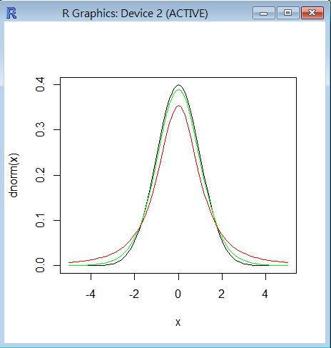

Ｒ函數：t(df, Del)

* 公式：T(df=n) := f(x) = Γ((n+1)/2) / (√(n π) Γ(n/2)) (1 + x^2/n)^-((n+1)/2)
* 擴充：T(df, Del) := (U + Del) / √(V/df) ; U ~ N(0,1) , V ~ χ^2(df) 且 (U,V) 獨立。
* 網址：http://stat.ethz.ch/R-manual/R-patched/library/stats/html/TDist.html

用途：可用來描述 n 個常態分布樣本平均值的分布。

描述：令 $X_1, X_2, ..., X_n$ 為一組來自常態分布 $N(\mu, \sigma^2)$ 的隨機樣本，則下列算式服從自由度 n-1 的 T 分布。

$\frac{\bar{X} - \mu }{S/\sqrt{n}}$

估計：當 $\sigma$ 未知時，$\mu$ 的 $100 (1-\alpha \%)$ 信賴區間如下

$\bar{x} \pm t_{\alpha/2} (s/\sqrt{n})$

R 程式範例一

```R
op=par(mfrow=c(2,2))
curve(dt(x, 1), -10, 10)
curve(dt(x, 5), -10, 10)
curve(dt(x, 10), -10, 10)
curve(dt(x, 100), -10, 10)

```

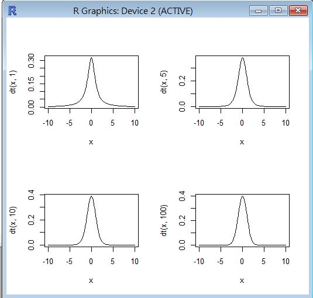


## F 分布 (F distribution)

* 卡方分布 $X_{\gamma 1}^2$ 與 $X_{\gamma 2}^2$ 互相獨立，則下列算式服從 F 分配。

$\frac{ X_{\gamma 1}^2 / \gamma 1}{ X_{\gamma 2}^2 / \gamma 2}$

Ｒ函數：F(df1 = n1 and df2 = n2)

* 公式：f(x) = Γ((n1 + n2)/2) / (Γ(n1/2) Γ(n2/2)) (n1/n2)^(n1/2) x^(n1/2 - 1) (1 + (n1/n2) x)^-(n1 + n2)/2
* 網址：http://stat.ethz.ch/R-manual/R-patched/library/stats/html/Fdist.html

特性: 可用來檢定兩組樣本的變異數 [$ \sigma_1^2 , \sigma_2^2$]] 是否相等。

R 程式範例一

```R
op=par(mfrow=c(2,2))
curve(df(x, 1,1), 0, 10)
curve(df(x, 10,1), 0, 10)
curve(df(x, 1,10), 0, 10)
curve(df(x, 10,10), 0, 10)

```

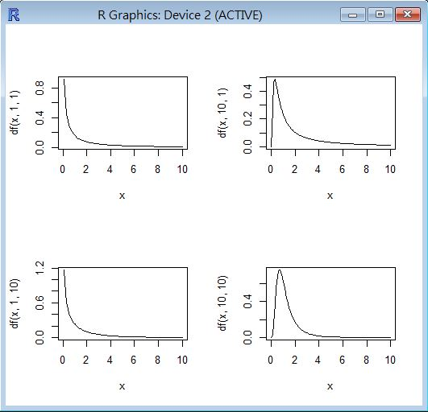

## 貝塔分布 (Beta distribution)

公式： $f(x)= \frac{Γ(a+b)}{Γ(a) Γ(b)} x^{a-1}(1-x)^{b-1}$

Ｒ函數：beta(a, b) 

* 公式： f(x)= Γ(a+b)/(Γ(a)Γ(b))x^(a-1)(1-x)^(b-1)
* 對應：[$ shape1 = a; shape2 = b  $]]
* 網址：http://stat.ethz.ch/R-manual/R-patched/library/stats/html/Beta.html

R 程式範例

```R
op=par(mfrow=c(2,2))
curve(dbeta(x, 1, 1))
curve(dbeta(x, 1, 5))
curve(dbeta(x, 5, 1))
curve(dbeta(x, 5, 5))
```

