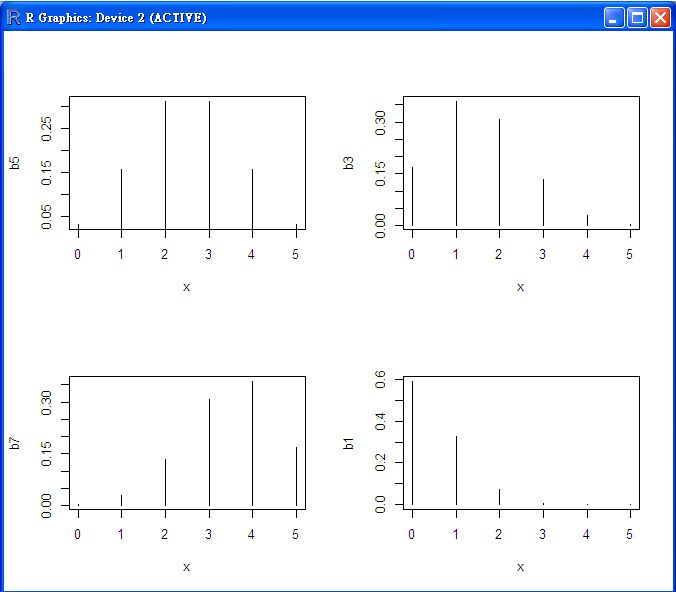
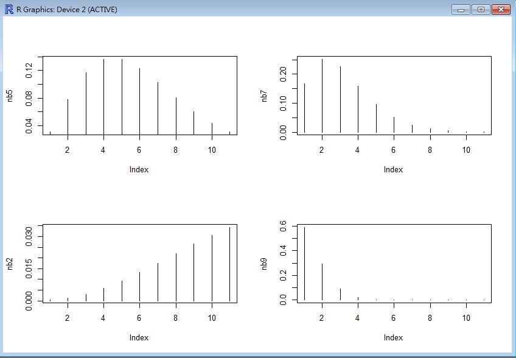
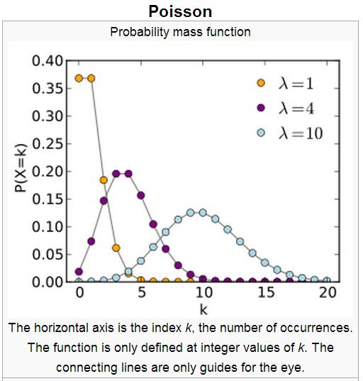
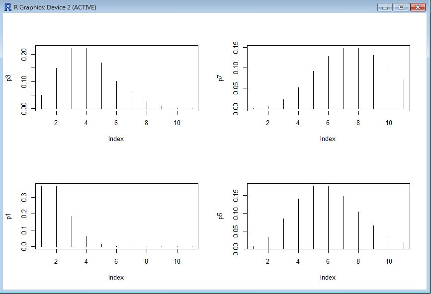
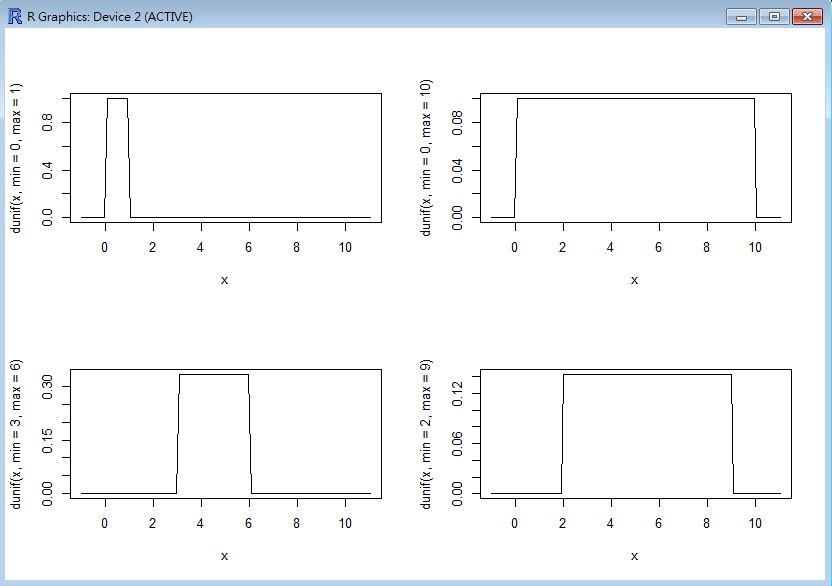
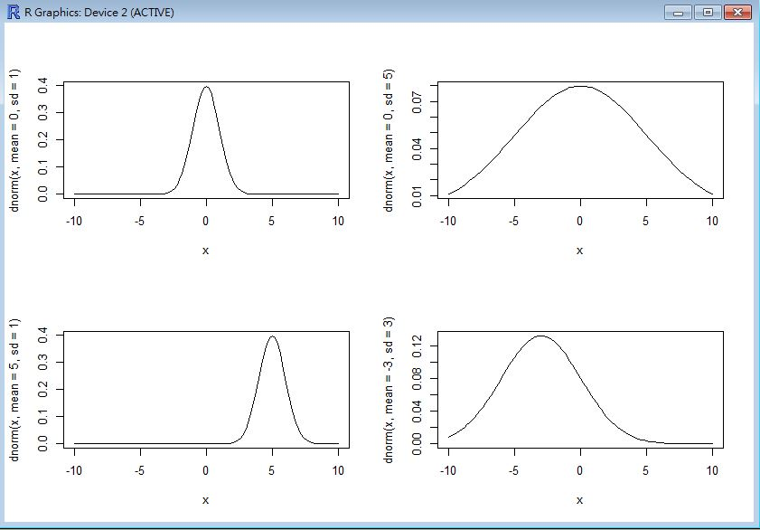

# 機率分布 

## 簡介

在程式設計領域，「設計模式」是一些經常被使用到的物件樣式，而在數學領域，也同樣存在著某些「常見模式」，在機率統計領域，這些「常見模式」就是機率分布。

機率分布可以分為「離散型」與「連續型」兩類，離散型的機率分布通常只會有整數型的值，而連續型的機率分布則在整個實數軸上都可能產生樣本。

## 伯努力試驗 (Bernoulli trial) 

所有的離散型機率分布，幾乎都是從「伯努力試驗」這個概念開始的，讓我們先來瞭解一下何謂「伯努力試驗」。

伯努利試驗是一項只有兩種可能結果的隨機試驗，可以用下列機率分布描述：

$P[X=1] = p ; P[X=0] = 1-p$

換句話說、伯努力試驗是一種 YES or NO (1 or 0) 的試驗。舉例而言，像是「丟銅版、生男生女、一地區某天最高溫是否超過 30 度、擲骰子是否超過 2 點」等等，都可以用伯努力實驗描述。

伯努力試驗的概念很簡單，以下是一些範例：

範例 1 : 

> 丟一個公正銅板，用隨機變數 X 將正面映射為 1 ，反面映射為 0，那麼就可以用 P[X=1]=0.5, P[X=0]=0.5 表示這個機率模型。

在 R 軟體中， Sample 函數可以用來模仿柏努力試驗。

舉例而言，以下是範例一的丟銅板試驗，指令 sample(0:1, 10, replace=T, prob=c(0.5,0.5)) 代表連續進行 10 次柏努力試驗，成功失敗機率各為 0.5。

```R
> sample(0:1, 10, replace=TRUE, prob=c(0.5,0.5))
 [1] 1 0 1 1 0 1 0 1 0 1
> sample(0:1, 10, replace=T)
 [1] 0 1 1 1 0 0 1 1 1 0
```

說明：X(反面)=0, X(正面)=1, 第一個參數 0:1 分別代表 {反面、正面} 的映射結果，而第二個參數代表只投擲一次，第三個參數 replace 代表樣本取後是否放回，這在頭銅板的範例必須用 replace=TRUE, 因為這次投正面之後不代表下次不能再出現正面，而 prob 則是指定的機率分布，如果不指定則代表採用平分的機率分布，以這個例子就是各為 0.5 的方式。

範例 2 : 

> 假如用機率描述生男生女這件事， X({生男})=1, X({生女})=0, 且生男生的機率為 0.53, 生女生的機率為 0.47，那麼就可以用 P[X=1]=0.53, P[X=0]=0.47 表示這個機率模型。

```R
> sample(0:1, 10, replace=T, prob=c(0.47, 0.53))
 [1] 0 1 1 0 1 1 0 1 1 0
```

## 二項分布 (Binomial distribution)

如果我們進行 n 次的伯努力試驗，每一次的實驗都可以用隨機變數描述， P(ti=1) = p, P(ti=0)=1-p ，而且這些試驗 {t1, t2, ...., tn} 之間是獨立的，那麼我們就可以用二項分布來描述 n 次實驗的可能機率分布。

由於這 n 次實驗相互獨立，假如 (t1 t2 ... tn) 代表這個實驗的一個可能出像，因此 P(t1 t2 .... tn) = P(t1) P(t2) .... P(tn)。

令 X 代表一個可以將 (t1 t2 ... tn) 映射到伯努力試驗成功 (Yes) 次數的函數，那麼、n 次實驗中出現 k 次 1 的機會，可以用以下算式表示。

$P(X=k) =  {n \choose k} p^k (1-p)^{n-k}$ 

舉例而言，投擲公正銅板 5 次，得到 3 次正面的機率為 $P(X=3) = {5 \choose 3} p^3 (1-p)^{5-3}$ ，其中 p=0.5。

範例：

> 假如生男生的機率為 0.53, 生女生的機率為 0.47，而且每位母親生男生女的事件之間都是獨立的。
> 
> 某母親 A 想要生 3 個小孩，請問至少有一個男生的機會為多少。
> 
> 用機率描述生男生女這件事， X({生男})=1, X({生女})=0, 那麼可以計算至少生一個男生的機率如下：
> 
> $P(X>=1) = P(X={2,3}) = \sum_{k \in \{2,3\}} {3 \choose k} p^k (1-p)^{n-k}$ ，其中 p = 0.53, (1-p) = 0.47。 

讓我們用 R 軟體計算一下

```R
> dbinom(1, 3, 0.53)+dbinom(2,3, 0.53)+dbinom(3,3,0.53)
[1] 0.896177
> sum(dbinom(c(1,2,3), 3, 0.53))
[1] 0.896177
> x=c(1,2,3)
> x
[1] 1 2 3
> p=dbinom(x, 3, 0.53)
> p
[1] 0.351231 0.396069 0.148877
> sum(p)
[1] 0.896177
```

### 二項分布的圖形

```R
> par(mfrow=c(2,2))
> x = 0:5
> b5 = dbinom(x, 5, 0.5)
> plot(x, b5, type="h")
> b3 = dbinom(x, 5, 0.3)
> plot(x, b3, type="h")
> b7 = dbinom(x, 5, 0.7)
> plot(x, b7, type="h")
> b1 = dbinom(x, 5, 0.1)
> plot(x, b1, type="h")
```



### 習題

1. 請問丟 10 個公平的銅板，有三個正面的機會是多少？
2. 請問丟 n 個公平的銅板，正面次數 <= k 的機率是多少？
3. 請問丟 10 個公平的銅板，得到正面次數的期望值為何？

## 幾何分布 (Geometric distribution)

如果我們連續進行一系列的伯努力試驗，直到成功才停止，那麼我們需要進行多少次實驗呢？

關於這種「直到成功才停止」的問題，可以用幾何分布來描述，以下是幾何分布的定義。

$P(X=k) = (1-p)^{k-1} p = q^{k-1} p$

舉例而言，假如我們連續投擲公正銅版，直到出現正面才停止，那麼我們需要投擲 k 次才會得到第一個正面的機率，就會是 $(1-p)^{k-1} p$ ，其中的 p=0.5。

範例：

> 假如生男生的機率為 0.53, 生女生的機率為 0.47，而且每位母親生男生女的事件之間都是獨立的。
> 
> 某位母親決定要一直生小孩，直到有一個女孩為止，請問她在生小孩個數不大於三個就能完成任務的機率為多少？
> 
> 用機率描述生男生女這件事， X({生女})=1, X({生男})=0, 那麼就可以累加下列算式以計算結果。
> 
> $\sum_{k=1}^{3} P(X=k) = \sum_{k=1}^{3} (1-p)^{k-1} p = \sum_{k=1}^{3} (1-0.47)^{k-1} 0.47$ 

讓我們用 R 軟體計算一下，必須注意的是，R 軟體中的幾何分布 dgeom 的定義為 $p(x) = p (1-p)^x$ ，也就是用失敗次數當 x，因此其公式與上面的有所不同，必須修改如下：(其中的 x 代表失敗次數)。

$P(X=x) = (1-p)^{x} p = q^{x} p$

```R
> dgeom(0, 0.47) # 0 次失敗，第 1 次就成功。
[1] 0.47
> dgeom(1, 0.47) # 1 次失敗，第 2 次才成功。
[1] 0.2491
> sum(dgeom(c(0,1,2), 0.47)) # 失敗 <= 2 次，生小孩不大於 3 個就成功了。
[1] 0.851123
```

### 習題

1. 請問丟公平的銅板時，得到第 1 次正面時投擲次數 k 的機率分布為何？該分布的期望值為何？

2. 請問丟公正的骰子時，得到第 1 次 6 點時投擲次數 k 的機率分布為何？該分布的期望值為何？

## 負二項分布

如果我們對「幾何分布」進行擴充，改成「持續進行試驗直到取得 r 次成功為止」，那麼其機率分布又該如何描述呢？

這樣的機率分布就稱為負二項分布，其公式如下：

$P(X=k) = {k-1 \choose r-1} (1-p)^{k-r} p^r$

舉例而言，假如我們連續投擲公正銅版，直到出現三次正面才停止，那麼我們需要投擲 k 次才會得到第一個正面的機率，就會是 ${k-1 \choose r-1} (1-p)^{k-r} p^r$，其中的 p=0.5。

讓我們用 R 軟體計算一下，必須注意的是，R 軟體中的負二項分布 dbinom 的定義為 $\Gamma(x+n)/(\Gamma(n) x!) p^n (1-p)^x$ ，也就是用 n=r, x=k-r-1 的代換方式。

其中的 x 同樣代表失敗次數，而 n 代表成功次數，Γ(n) 代表排列數，所以 Γ(x+n)/(Γ(n) x!) 其實也就是 (x+n-1)!/((n-1)! x!) ，也就是 ${x+n-1 \choose x}$ 的意思。

R 的操作範例

```R
> dnbinom(0, 3, 0.5) # 失敗 0 次，連續成功 3 次。
[1] 0.125
> dnbinom(1, 3, 0.5) # 失敗 1 次，成功 3 次，第 4 次才達到 3 次成功。
[1] 0.1875
> dnbinom(0:10, 3, 0.5) # 失敗 10 次以下，成功 3 次，第 13 次前就成功 3 次。
 [1] 0.125000000 0.187500000 0.187500000 0.156250000 0.117187500 0.082031250
 [7] 0.054687500 0.035156250 0.021972656 0.013427734 0.008056641
> n=3
> x=1 
> p=0.5
> gamma(x+n)/(gamma(n)*prod(1:x)) * p^n * (1-p)^x
[1] 0.1875
> choose(x+n, n) * p^n * (1-p)^x
[1] 0.25
> choose(x+n-1, x) * p^n * (1-p)^x
[1] 0.1875
```

範例：

> 假如生男生的機率為 0.53, 生女生的機率為 0.47，而且每位母親生男生女的事件之間都是獨立的。
> 
> 某位母親決定要一直生小孩，直到有三個女孩為止，請問她在生小孩個數不大於 5 個就能完成任務的機率為多少？
> 
> 用機率描述生男生女這件事， X({生女})=1, X({生男})=0, 那麼就可以累加下列算式以計算結果。
> 
> $\sum_{k=1}^{5} P(X=k) = \sum_{k=1}^{5} {k-1 \choose r-1} (1-p)^{k-r} p^r$ , 其中 p=0.47, r=3。

但是由於 R 是用失敗次數，所以必須改成：

> $\sum_{k=1}^{5} P(X=k) = \sum_{x=0}^{2} {x+n-1 \choose x-1} (1-p)^x p^n$ , 其中 p=0.47, n=3。

於是操作如下：

```R
> dnbinom(0, 3, 0.47)
[1] 0.103823
> dnbinom(1, 3, 0.47)
[1] 0.1650786
> dnbinom(2, 3, 0.47)
[1] 0.1749833
> dnbinom(c(0,1,2), 3, 0.47)
[1] 0.1038230 0.1650786
[3] 0.1749833
> sum(dnbinom(c(0,1,2), 3, 0.47))
[1] 0.4438849
>
```

### 負二項分布的圖形

```R
> par(mfrow=c(2,2))
> nb5 = dnbinom(x, 5, 0.5)
> plot(nb5, type="h")
> nb7 = dnbinom(x, 5, 0.7)
> plot(nb7, type="h")
> nb2 = dnbinom(x, 5, 0.2)
> plot(nb2, type="h")
> nb9 = dnbinom(x, 5, 0.9)
> plot(nb9, type="h")
```



## 布瓦松分布 (Poisson distribution)

在離散機率分布當中，布瓦松分布算是相當特別的一個，因為「布瓦松分布」是描述「連續區域內出現幾個樣本」的分布。舉例而言，像是舀一瓢水會撈到的草履蟲數量，或者抽一滴血會抽到的白血球數量等等。

布瓦松分布的公式如下所示，其中的 $\lambda$ 代表每單位區域內會出現的樣本平均數。

$P(X=k) = \lambda^k e^{-\lambda}/k!$


要瞭解布瓦松分布，得從二項分布的極限開始想起，以下是三種不同 $\lambda$ 參數的布瓦松分布圖：



事實上、布瓦松分布是二項分布在 n 趨近無限大的極限情況。


為了說明布瓦松分布與二項分布之間的關係，讓我們用以下的白血球範例來看看隱藏在這兩個分布背後的關係：

範例：抽血時白血球數量的問題

> 問題： 假如現在從你身上抽一滴血，請回答下列兩個問題。
> 
> 1 - 請定義一個隨機變數 X 代表那滴血中的白血球數量。
> 
> 提示： 樣本空間 S = 此時此刻你身上的所有白血球 = {w1,w2,......,wn}
> 
> 2 - 請算出一滴血液中有三顆白血球的機率，假設該滴血液占你總血量的 1/1000。

解答 1：

>  X(A) = |A|
> 
> 說明： 
> 
> A 是一個事件，也就是白血球的樣本空間 S 的子集合，例如： A = {w1, w5, w9}
> 
> |A| 代表 A 集合的大小，也就是元素個數，舉例而言：
> 
>   如果 A = {w1, w5, w9} ，那麼 |A| = 3
> 
>   如果 B = {w2, w8}，那麼 |B| = 2
> 
>   如果 C = {}，那麼 |C| = 0
> 
>   如果 D = S，那麼 |D| = n
  
解答 2：

> P(X=3) = P({A | X(A) = 3}) = P({{w1, w2, w3}) + P({w1, w2, w4}) + ......
> 
> 假如任一顆白血球被抽到的機率等於該滴血液佔全身血液的比率，由於該滴血液佔總血量的 1/1000，所以給顆白血球被抽到的機率為 1/1000。
> 
> 而且假設這些白血球沒有智慧，也不會聚合在一起，因此相互之間獨立，那麼由於每顆白血球被抽到的機率為 1/1000，因此 P(w1) = P(w2) = .... P(wn) = 1/1000。
> 
> 那麼初步想法是 P(w1w3) = P(w1) * P(w3) = 1/1000 * 1/1000 。
> 
> 但是上述的想法有個小問題，那就是該情況代表其它白血球都沒被抽到，因此所謂的 P(w1w3) 真正的意思應該是
> 
> $P(w_1 \bar{w_2} w_3 \bar{w_4} .... \bar{w_n}) = (\frac{1}{1000})^2  (\frac{999}{1000})^{n-2}$
> 
> 所以 P(X=3) 應該算法如下：
> 
> $P(X=3) = P(\{A| X(A) = 3\}) = (\frac{1}{1000})^3  (\frac{999}{1000})^{n-3}  {n \choose 3}$
> 
> 推而廣之，P(X=k) 的機率之算法如下：
> 
> $P(X=k) = P(\{A| X(A) = k\}) = (\frac{1}{1000})^k  (\frac{999}{1000})^{n-k}  {n \choose k}$
> 
> 事實上，這個題目的機率分布就是下一章的二項分布，如下所示：
>
> $P(X=k) = {n \choose k} p^k (1-p)^{n-k}$
> 
> 而且、當 n 趨近於無限大時，這個分布將會趨近於布瓦松分布，如下所示：
> 
> $P(X=k) = \lambda^k e^{-\lambda}/k!$
> 
> 其中的 λ 之意義為，在單位時間 (或單位面積、體積) 內，事件的出現次數平均為 λ 次。

### 習題

習題：假設每 1CC 的血所含的白血球平均為 10 顆，那麼請問你抽 1CC 的血時，抽到 8 顆白血球的機率是多少。

解答：

> λ = 10，因此布瓦松分布為 $p(x) = 10^x e^{-10}/x!$ ，將 x=8 代入，得到 $p(8) = 10^8 e^{-10}/8!$ 

其數值可以用 R 軟體計算，如下所示：

```R
> ?dpois
> dpois(8, 10)
[1] 0.112599
> 10^8*e^(-10)/factorial(8)
[1] 0.01125998
>
```

抽到 12 個白血球的機率 (λ = 10)

```R
> dpois(12, 10)
[1] 0.09478033
```

假如平均抽一滴血液的白血球數量為 5.5 個，請問抽一滴血得到 3 個白血球的機率。

```R
> dpois(3, 5.5)
[1] 0.1133228
> 5.5^3*e^(-5.5)/factorial(3)
[1] 0.1133232
```

### 布瓦松分布的圖形

```R
> par(mfrow=c(2,2))
> x = 0:10
> p3 = dpois(x, lambda=3)
> plot(p3, type="h")
> p7 = dpois(x, lambda=7)
> plot(p7, type="h")
> p1 = dpois(x, lambda=1)
> plot(p1, type="h")
> p5 = dpois(x, lambda=5)
> plot(p5, type="h")
```




### 為何二項分布在 n 很大時會趨近布瓦松分布呢？

> 根據二項分布的公式
> 
> $P(X=k) = {n \choose k} p^k (1-p)^{n-k}$
> 
> 假如 n 很大，且抽取 1 單位體積內的平均個數為 λ，總體積為 M，則總共的個數 n = M λ，且每個樣本被抽到的機會為 1/M。
> 
> 而且、當 n 趨近於無限大，也就是 M 趨近無限大時，上述分布可以改寫如下。
> 
> $\lim_{n\to\infty} P(X=k) = {n \choose k} p^k (1-p)^{n-k} = {M \lambda \choose k} (1/M)^k (1-(1/M))^{M \lambda-k}$
> 
> 當 k 很小時， $(1-(1/M))^{M \lambda-k} \sim (1-(1/M))^{M \lambda} = e^{-\lambda}$ 且 ${M \lambda \choose k} = (M \lambda)*(M \lambda-1)...(M \lambda-k)/k! \sim (M \lambda)^k/k! $
> 
> 所以可得 $ {M \lambda \choose k} (1/M)^k (1-(1/M))^{M \lambda-k} \sim (M \lambda)^k/(M^k k!) e^{-\lambda} = \lambda^k e^{-\lambda}/k!$
> 
> 所以可得 $P(X=k) = \lambda^k e^{-\lambda}/k!$ 


## 均勻分布 (Uniform distribution)

### 均勻分布的圖形

```R
> dunif(0.5)
[1] 1
> dunif(0.9)
[1] 1
> dunif(2)
[1] 0
> dunif(-1)
[1] 0
> par(mfrow=c(2,2))
> x=0:10
> curve(dunif(x, min=0, max=1), from=-1, to=11)
> curve(dunif(x, min=0, max=10), from=-1, to=11)
> curve(dunif(x, min=3, max=6), from=-1, to=11)
> curve(dunif(x, min=2, max=9), from=-1, to=11)
```



## 常態分布 (Normal Distribution)

### 常態分布的圖形

```R
> dnorm(0)
[1] 0.3989423
> dnorm(0.5)
[1] 0.3520653
> dnorm(2.5)
[1] 0.0175283
> par(mfrow=c(2,2))
> curve(dnorm(x, mean=0, sd=1), from=-10, to=10)
> curve(dnorm(x, mean=0, sd=5), from=-10, to=10)
> curve(dnorm(x, mean=5, sd=1), from=-10, to=10)
> curve(dnorm(x, mean=-3, sd=3), from=-10, to=10)
```



## 附件：離散型機率分布表格整理

以下是離散型機率分布的匯總表格，讀者現在還看不懂的話沒有關係，我們在後文中會解說其中較重要的幾個分布。

| 離散機率模型 | 密度函數 | R 函數名稱 | 說明 |
|--------------|----------|------------|------|
| 二項分布 | ${n \choose x} p^x (1-p)^{n-x}$ | binom(n:size, p:prob) | n:樣本數, p:正面機率, <br/> n 次試驗中有 x 個成功的機率 |
| 多項分布	| $\frac{n!}{x_1!...x_k!}  p_1^{x_1}...p_k^{x_k}$ | multinom(n:size, p(1..k):prob) | n:樣本數, p[1..n]:各項的機率  |
| 負二項分布 | ${x-1 \choose r-1} (1-p)^{x-r} p^r$ | nbinom(size, prob) | x:樣本數, , p:正面機率, <br/> 要得到第 r 次成功所需要的試驗次數 |
| 幾何分布	| $(1-p)^{x-1} p$ | geom(p:prob) | p: 成功機率, 第一次成功所需要的試驗次數 |
| 超幾何分布	| $\frac{{ r \choose x} {N-r \choose n-x}}{N \choose n}$ | hyper(N:m,n:n,r:k) | m:白球數量, n:黑球數量, k:抽出球數, <br/> 同二項分布，但取樣後不放回 |
| 布瓦松分布	| $\frac{e^{-\lambda s} {\lambda s}^x}{x!}$ | pois(lambda) | k:期望值, $\lambda = \frac{k}{s}$, <br/> 在 s 時間內，事件出現平均 k 次 |

## 附件：連續型機率分布表格整理

以下是連續型機率分布的匯總表格，讀者現在還看不懂的話沒有關係，我們在後文中會解說其中較重要的幾個分布。

| 連續機率模型 | 密度函數 | R 函數 | 說明 |
|--------------|----------|--------|------|
| 均勻分布 (Uniform) | $\frac{1}{b-a}$ | unif(a:min, b:max) | a:範圍下限, b: 上限 <br/> 出現機會均等 |
| 常態分布(Normal) | $\frac{1}{\sqrt{2\pi} \sigma} e^{- \frac{1}{2} [(x-\mu)/\sigma]^2}$ | norm(mean, sd) | 中央極限定理：x1+x2+...+xk; 當 k 越大就越接近常態分布 | 
| 伽瑪分布 (Gamma) | $\frac{1}{\Gamma(a) b^{a}} x^{a-1} e^{-x/b}$ | gamma(shape, rate = 1, scale = 1/rate) |  $\Gamma(k) = \int_{0}^{\infty} z^{k-1} e^{-z} dz$ <br/>  指數分布與卡方分布都是 Gamma 分布的特例 |
| 指數分布	(Exponential)| $\frac{1}{b} e^{-x/b}$ | exp(rate) | 伽瑪分布($a=1, b=\frac{1}{\lambda}$) <br/> 布瓦松過程中，第一次事件出現的時間 W |
| 卡方分布 (Chi-Square) |  $\frac{1}{2^{\gamma/2}\Gamma(\gamma/2)}\,x^{\gamma/2 - 1} e^{-x/2}$ | chisq(df, ncp) | 伽瑪分布( $b=2, a=\gamma/2$ ) <br/> 利用樣本推斷母體變異數 | 
| 柯西分布 (Cauchy) | $\frac{1}{\pi} \frac{a}{a^2 + (x-b)^2}$ | cauchy(b:location, a:scale)  | |
| 威布爾分布 (Weibull)| $a b x^{b-1} e^{-a x^{b}}$ | weibull(a:shape, b:scale) | $\rho(t)=\frac{f(t)}{R(t)}$ <br/> 可靠度工程：f(x) 失敗時間, R(t) 可靠度,$\rho(t)$ 失敗率 |
| T 分布 (T)	| $\frac{Z}{\sqrt{X_{\gamma}^2/\gamma}}$ | t(df, ncp) | 估計變異數時使用的分布 | 
| F 分布 (F)	|  $\frac{ X_{ \gamma_1 }^2 / \gamma_1 }{ X_{ \gamma_2 }^2/ \gamma_2 }$ |  f(df1, df2, ncp) | 等變異數 F 檢定時使用 | 
| 貝塔分布 (Beta) |   | beta(a:shape1, b:shape2, ncp) |  | 
| 對數常態分布	 (Log Normal) | |  lnorm(meanlog, sdlog) | | 
| 邏輯分布	| | logis(location, scale)	| |
| Signrank	| | signrank(n)	| |
| 威爾斯	| | wilcox(m, n) | a,b 為兩組樣本 | 


